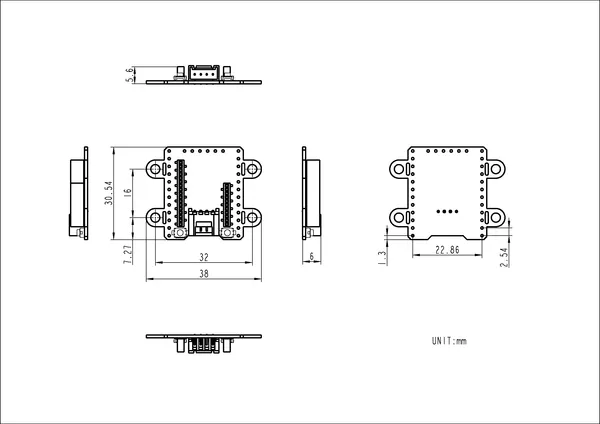

# Stamp-S3 BreakOut

**M5Stack** · Source collection

Revision: Unverified source identity  
Coverage: Source collection; review pending

[Browse all manufacturers](../../../../BROWSE.md) · [Desktop app](https://github.com/valleytechsolutions/black-wire-desktop)

## Dimensions

**source reference** · Unreviewed source · PNG

[Open original reference](../../../../library/media/e37955fa9fde10d9c899dedfdc11474d5905de5f223ace3eea6b7e5d16983181.png)

**Credit and rights:** Source rights not yet established. Source/manufacturer: M5Stack.

[Source 1](https://static-cdn.m5stack.com/resource/docs/products/unit/StampS3BreakOut/img-936aff59-912e-4a07-b254-6b248529c427.png) · [Source 2](https://docs.m5stack.com/en/stamp/StampS3BreakOut)

Original source index: Dimensions. This file is searchable but has not been promoted to a reviewed physical board pinout.

SHA-256: `e37955fa9fde10d9c899dedfdc11474d5905de5f223ace3eea6b7e5d16983181`

Pin assignments have not been independently electrically verified. Check board revision before wiring.
