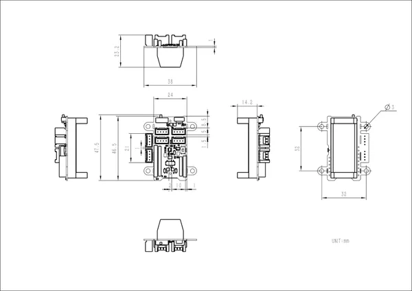

# Stamp-S3 GroveBreakOut

**M5Stack** · Source collection

Revision: Unverified source identity  
Coverage: Source collection; review pending

[Browse all manufacturers](../../../../BROWSE.md) · [Desktop app](https://github.com/valleytechsolutions/black-wire-desktop)

## Dimensions

**source reference** · Unreviewed source · JPG

[Open original reference](../../../../library/media/28cb00b216741caf80202efdad32bf6a70b74d60d1cbacf2d6ecbc0a415a4d01.jpg)

**Credit and rights:** Source rights not yet established. Source/manufacturer: M5Stack.

[Source 1](https://static-cdn.m5stack.com/resource/docs/products/accessory/StampS3 GroveBreakOut/img-e8ab287a-1891-4198-b612-2fc70f785838.jpg) · [Source 2](https://docs.m5stack.com/en/accessory/StampS3%20GroveBreakOut)

Original source index: Dimensions. This file is searchable but has not been promoted to a reviewed physical board pinout.

SHA-256: `28cb00b216741caf80202efdad32bf6a70b74d60d1cbacf2d6ecbc0a415a4d01`

Pin assignments have not been independently electrically verified. Check board revision before wiring.
