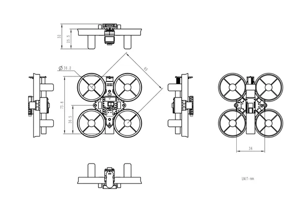
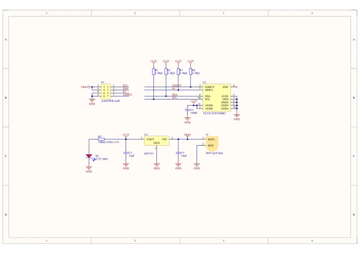
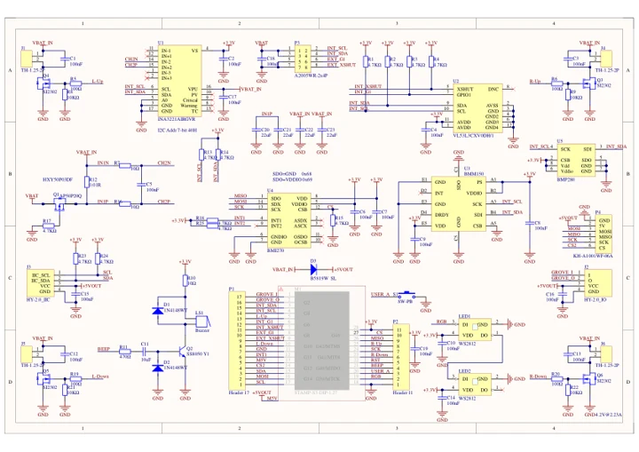
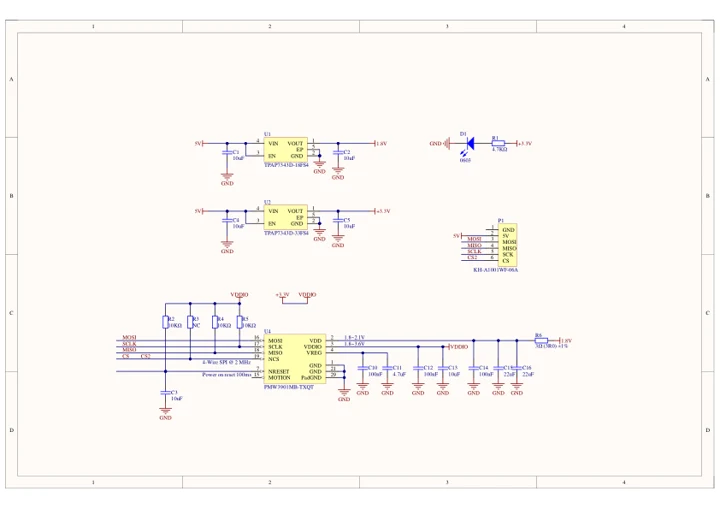

# StampFly v1.1

**M5Stack** · Source collection

Revision: Unverified source identity

Coverage: Manufacturer references reviewed by scope; independent electrical and all-connector review pending

[Browse all manufacturers](../../../../BROWSE.md) · [Devices & IoT](../../../../DEVICES.md) · [Open in the browser guide](https://valleytech-black-wire-guide.pages.dev/?board=source-board-00671040984b2260ab)

## Datasheets and original documentation

Board datasheet: **not yet recorded**. Visual reference: **available**.

[Manufacturer hardware documentation](https://docs.m5stack.com/en/app/StampFly_v1.1)

- **schematic / recorded-source**: [StampS3_Fly_Hat Schematic PDF](https://m5stack-doc.oss-cn-shenzhen.aliyuncs.com/1069/StampS3_Fly_Hat.pdf) · [saved document](../../../../library/media/bdd7b6ae25cb69f92ffa86f407b0c9b4cf4886bb930bf7cc9312ee76bc113dea.pdf)
- **schematic / recorded-source**: [Stamp_Fly Schematic PDF](https://m5stack-doc.oss-cn-shenzhen.aliyuncs.com/1069/Stamp_Fly_v1.0.pdf) · [saved document](../../../../library/media/cd723159b898d840743cbd470388d74a61ae57bc26bc336251670979214111f4.pdf)
- **schematic / recorded-source**: [PMW3901MB Schematic PDF](https://m5stack-doc.oss-cn-shenzhen.aliyuncs.com/1069/Sch_PMW3901MB_SPI.pdf) · [saved document](../../../../library/media/f8a7d9e79c124a9ed680124977a285e10c406262756532b006e835fa925085a6.pdf)
- **hardware-guide / board**: [Manufacturer pin and hardware documentation](https://docs.m5stack.com/en/app/StampFly_v1.1) · online

A chip datasheet, schematic and board datasheet have different scopes. Match the exact hardware revision.

[Documentation coverage and remaining gaps](../../../../DOCUMENTATION.md)

## Dimensions

**source reference** · Unreviewed source · PNG

[Open original reference](../../../../library/media/a269b1b0ca4102fedfd6694f21fd80680940de95ce6a5b72c5c73c5fad76ee8c.png)

**Credit and rights:** Source rights not yet established. Source/manufacturer: M5Stack.

[Source 1](https://m5stack-doc.oss-cn-shenzhen.aliyuncs.com/1247/K138-V11_StampFly_v1.1_model_size_page_01.png) · [Source 2](https://docs.m5stack.com/en/app/StampFly_v1.1)

Original source index: Dimensions. This file is searchable but has not been promoted to a reviewed physical board pinout.

Image revision: Not identified

SHA-256: `a269b1b0ca4102fedfd6694f21fd80680940de95ce6a5b72c5c73c5fad76ee8c`

## StampS3_Fly_Hat Schematic PDF

**original reference PDF** · Manufacturer source and first-page preview inspected; electrical correctness and all-connector completeness not independently approved. · PDF

[Open original reference](../../../../library/media/bdd7b6ae25cb69f92ffa86f407b0c9b4cf4886bb930bf7cc9312ee76bc113dea.pdf)

**Credit and rights:** Manufacturer artwork; reuse and print rights not established. Inclusion does not relicense the original.. Source/manufacturer: M5Stack.

[Source 1](https://m5stack-doc.oss-cn-shenzhen.aliyuncs.com/1069/StampS3_Fly_Hat.pdf) · [Source 2](https://docs.m5stack.com/en/app/StampFly_v1.1)

Manufacturer source retained unchanged. Manufacturer source and first-page preview inspected; electrical correctness and all-connector completeness not independently approved.

Image revision: As supplied in the original; match exact board revision

SHA-256: `bdd7b6ae25cb69f92ffa86f407b0c9b4cf4886bb930bf7cc9312ee76bc113dea`

## Stamp_Fly Schematic PDF

**original reference PDF** · Manufacturer source and first-page preview inspected; independent electrical and all-connector completeness review pending. · PDF

[Open original reference](../../../../library/media/cd723159b898d840743cbd470388d74a61ae57bc26bc336251670979214111f4.pdf)

**Credit and rights:** Manufacturer artwork; reuse and print rights not established. Inclusion does not relicense the original.. Source/manufacturer: M5Stack.

[Source 1](https://m5stack-doc.oss-cn-shenzhen.aliyuncs.com/1069/Stamp_Fly_v1.0.pdf) · [Source 2](https://docs.m5stack.com/en/app/StampFly_v1.1)

Manufacturer source retained unchanged. Manufacturer source and first-page preview inspected; independent electrical and all-connector completeness review pending.

Image revision: As supplied in the original; match exact board revision

SHA-256: `cd723159b898d840743cbd470388d74a61ae57bc26bc336251670979214111f4`

## PMW3901MB Schematic PDF

**original reference PDF** · Manufacturer source and first-page preview inspected; electrical correctness and all-connector completeness not independently approved. · PDF

[Open original reference](../../../../library/media/f8a7d9e79c124a9ed680124977a285e10c406262756532b006e835fa925085a6.pdf)

**Credit and rights:** Manufacturer artwork; reuse and print rights not established. Inclusion does not relicense the original.. Source/manufacturer: M5Stack.

[Source 1](https://m5stack-doc.oss-cn-shenzhen.aliyuncs.com/1069/Sch_PMW3901MB_SPI.pdf) · [Source 2](https://docs.m5stack.com/en/app/StampFly_v1.1)

Manufacturer source retained unchanged. Manufacturer source and first-page preview inspected; electrical correctness and all-connector completeness not independently approved.

Image revision: As supplied in the original; match exact board revision

SHA-256: `f8a7d9e79c124a9ed680124977a285e10c406262756532b006e835fa925085a6`

Pin assignments have not been independently electrically verified. Check board revision before wiring.
