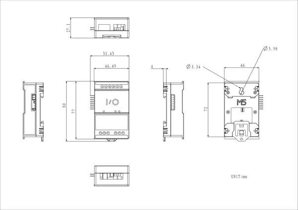

# StamPLC IO

**M5Stack** · Source collection

Revision: Unverified source identity  
Coverage: Source collection; review pending

[Browse all manufacturers](../../../../BROWSE.md) · [Desktop app](https://github.com/valleytechsolutions/black-wire-desktop)

## Dimensions

**source reference** · Unreviewed source · PNG

[Open original reference](../../../../library/media/cba3d2277814f59a3ad051b6d1e12ea1d09b6d04d28146680b3b1e03d08baf86.png)

**Credit and rights:** Source rights not yet established. Source/manufacturer: M5Stack.

[Source 1](https://m5stack-doc.oss-cn-shenzhen.aliyuncs.com/1257/A176_StamPLC_IO_model_size_page_01.png) · [Source 2](https://docs.m5stack.com/en/stamplc/StamPLC_IO)

Original source index: Dimensions. This file is searchable but has not been promoted to a reviewed physical board pinout.

SHA-256: `cba3d2277814f59a3ad051b6d1e12ea1d09b6d04d28146680b3b1e03d08baf86`

Pin assignments have not been independently electrically verified. Check board revision before wiring.
