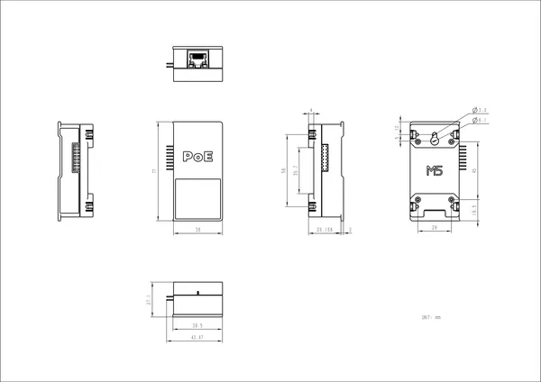
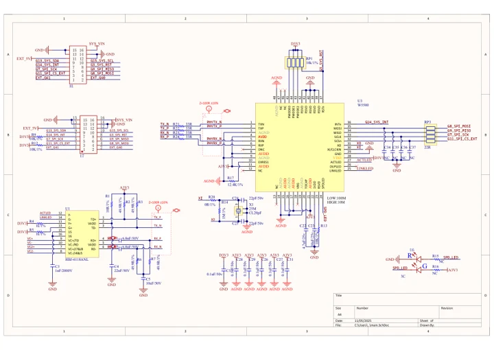

# StamPLC PoE

**M5Stack** · Source collection

Revision: Unverified source identity

Coverage: Manufacturer references reviewed by scope; independent electrical and all-connector review pending

[Browse all manufacturers](../../../../BROWSE.md) · [Devices & IoT](../../../../DEVICES.md) · [Open in the browser guide](https://valleytech-black-wire-guide.pages.dev/?board=source-board-74eada22f46e8feb79)

## Datasheets and original documentation

Board datasheet: **not yet recorded**. Visual reference: **available**.

[Manufacturer hardware documentation](https://docs.m5stack.com/en/stamplc/StamPLC_PoE)

- **schematic / board**: [StamPLC PoE Schematics PDF](https://m5stack-doc.oss-cn-shenzhen.aliyuncs.com/1202/SCH_StamPLC_PoE_SCH_MAIN_V1.0_20251104_2025_12_02_17_25_33.pdf) · [saved document](../../../../library/media/e43ebdc848f4d6a1d22b6c1044acde19871fc8b237fe8b9625163146eb047ebb.pdf)
- **hardware-guide / board**: [Manufacturer pin and hardware documentation](https://docs.m5stack.com/en/stamplc/StamPLC_PoE) · online

A chip datasheet, schematic and board datasheet have different scopes. Match the exact hardware revision.

[Documentation coverage and remaining gaps](../../../../DOCUMENTATION.md)

## Dimensions

**source reference** · Unreviewed source · PNG

[Open original reference](../../../../library/media/97f8866b46cce218d8dd5b92439b06ff302a398be96d5dac5be2f67373aea6b8.png)

**Credit and rights:** Source rights not yet established. Source/manufacturer: M5Stack.

[Source 1](https://m5stack-doc.oss-cn-shenzhen.aliyuncs.com/1202/A165-model-size-stamplc-poe_page_01.png) · [Source 2](https://docs.m5stack.com/en/stamplc/StamPLC_PoE)

Original source index: Dimensions. This file is searchable but has not been promoted to a reviewed physical board pinout.

Image revision: Not identified

SHA-256: `97f8866b46cce218d8dd5b92439b06ff302a398be96d5dac5be2f67373aea6b8`

## StamPLC PoE Schematics PDF

**original reference PDF** · Source identity and visual scope inspected; PDF review covers first-page preview. Independent electrical and all-connector completeness review pending. · PDF

[Open original reference](../../../../library/media/e43ebdc848f4d6a1d22b6c1044acde19871fc8b237fe8b9625163146eb047ebb.pdf)

**Credit and rights:** Manufacturer artwork; reuse and print rights not established. Inclusion does not relicense the original.. Source/manufacturer: M5Stack.

[Source 1](https://m5stack-doc.oss-cn-shenzhen.aliyuncs.com/1202/SCH_StamPLC_PoE_SCH_MAIN_V1.0_20251104_2025_12_02_17_25_33.pdf) · [Source 2](https://docs.m5stack.com/en/stamplc/StamPLC_PoE)

Manufacturer source retained unchanged. Source identity and visual scope inspected; PDF review covers first-page preview. Independent electrical and all-connector completeness review pending.

Image revision: As supplied in the original; match exact board revision

SHA-256: `e43ebdc848f4d6a1d22b6c1044acde19871fc8b237fe8b9625163146eb047ebb`

Pin assignments have not been independently electrically verified. Check board revision before wiring.
