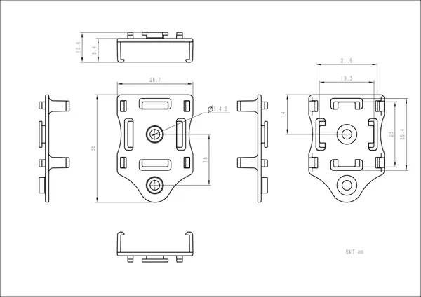
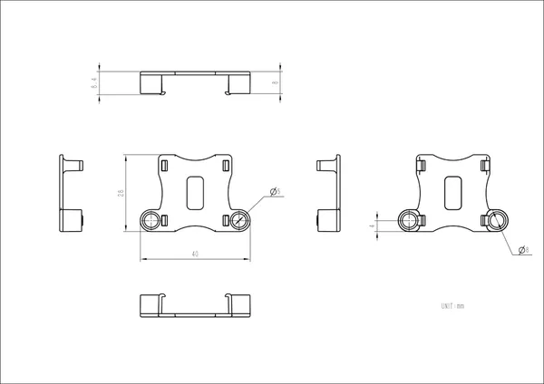
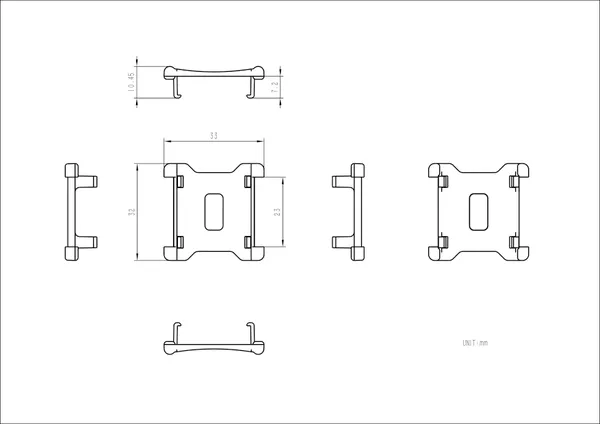

# Stick Watch Accessory Kit

**M5Stack** · Source collection

Revision: Unverified source identity  
Coverage: Source collection; review pending

[Browse all manufacturers](../../../../BROWSE.md) · [Devices & IoT](../../../../DEVICES.md) · [Open in the browser guide](https://valleytech-black-wire-guide.pages.dev/?board=source-board-dc0349f59be7face17)

Device category: **Wearables**

## Dimensions

**source reference** · Unreviewed source · JPG

[Open original reference](../../../../library/media/86eaf31ecafc87d4c7eeaae313668d5034c49800be98b1653766d99eb6bd4d99.jpg)

**Credit and rights:** Source rights not yet established. Source/manufacturer: M5Stack.

[Source 1](https://m5stack.oss-cn-shenzhen.aliyuncs.com/resource/docs/products/core/M5StickC%20PLUS2/148c931a782264fa73700b89a6060bb.jpg) · [Source 2](https://docs.m5stack.com/en/accessory/Stick_Watch_Accessory_Kit)

Original source index: Dimensions. This file is searchable but has not been promoted to a reviewed physical board pinout.

Image revision: Not identified

SHA-256: `86eaf31ecafc87d4c7eeaae313668d5034c49800be98b1653766d99eb6bd4d99`

## Dimensions

**source reference** · Unreviewed source · JPG

[Open original reference](../../../../library/media/05253e5094d741f2fec5e5666e5d721fbdf873068ab9cdb1bad26d1aefcc1494.jpg)

**Credit and rights:** Source rights not yet established. Source/manufacturer: M5Stack.

[Source 1](https://m5stack.oss-cn-shenzhen.aliyuncs.com/resource/docs/products/core/M5StickC%20PLUS2/e537f92bdea6ec347037fd8ee014b84.jpg) · [Source 2](https://docs.m5stack.com/en/accessory/Stick_Watch_Accessory_Kit)

Original source index: Dimensions. This file is searchable but has not been promoted to a reviewed physical board pinout.

Image revision: Not identified

SHA-256: `05253e5094d741f2fec5e5666e5d721fbdf873068ab9cdb1bad26d1aefcc1494`

## Dimensions

**source reference** · Unreviewed source · JPG

[Open original reference](../../../../library/media/465506b0340443fb4dc9c8ae058c9db6c8347b22f36178b738c5bf31d742b1a3.jpg)

**Credit and rights:** Source rights not yet established. Source/manufacturer: M5Stack.

[Source 1](https://m5stack.oss-cn-shenzhen.aliyuncs.com/resource/docs/products/core/M5StickC%20PLUS2/f1243c84791dc7551d58d683edb6aab.jpg) · [Source 2](https://docs.m5stack.com/en/accessory/Stick_Watch_Accessory_Kit)

Original source index: Dimensions. This file is searchable but has not been promoted to a reviewed physical board pinout.

Image revision: Not identified

SHA-256: `465506b0340443fb4dc9c8ae058c9db6c8347b22f36178b738c5bf31d742b1a3`

Pin assignments have not been independently electrically verified. Check board revision before wiring.
