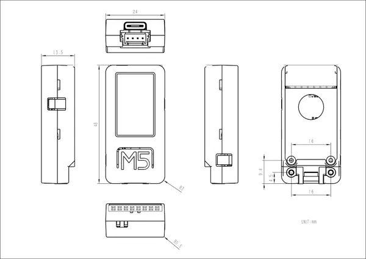

# StickC-Plus2 Watch Kit

**M5Stack** · Source collection

Revision: Unverified source identity  
Coverage: Source collection; review pending

[Browse all manufacturers](../../../../BROWSE.md) · [Desktop app](https://github.com/valleytechsolutions/black-wire-desktop)

## Dimensions

**source reference** · Unreviewed source · JPG

[Open original reference](../../../../library/media/7eb4cb986c051267dee781ed17ccad21ff6d523891875ad89a1e377331f6f07f.jpg)

**Credit and rights:** Source rights not yet established. Source/manufacturer: M5Stack.

[Source 1](https://m5stack.oss-cn-shenzhen.aliyuncs.com/resource/docs/products/core/m5stickc_plus/%E5%B0%BA%E5%AF%B8%E5%9B%BE.jpg) · [Source 2](https://docs.m5stack.com/en/accessory/M5StickC%20Plus2%20with%20Watch%20Accessories)

Original source index: Dimensions. This file is searchable but has not been promoted to a reviewed physical board pinout.

SHA-256: `7eb4cb986c051267dee781ed17ccad21ff6d523891875ad89a1e377331f6f07f`

Pin assignments have not been independently electrically verified. Check board revision before wiring.
