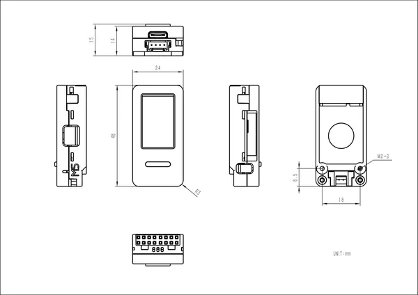
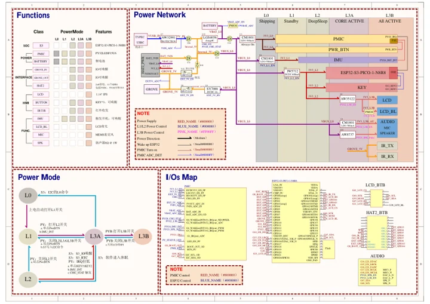

# StickS3

**M5Stack** · Source collection

Revision: Unverified source identity

Coverage: Manufacturer references reviewed by scope; independent electrical and all-connector review pending

[Browse all manufacturers](../../../../BROWSE.md) · [Devices & IoT](../../../../DEVICES.md) · [Open in the browser guide](https://valleytech-black-wire-guide.pages.dev/?board=source-board-baa53577358800c353)

Device category: **Controllers & instruments**

## Datasheets and original documentation

Board datasheet: **not yet recorded**. Visual reference: **available**.

[Manufacturer hardware documentation](https://docs.m5stack.com/en/core/StickS3)

- **schematic / board**: [StickS3 Schematics PDF](https://m5stack-doc.oss-cn-shenzhen.aliyuncs.com/1207/K150_Stick_S3_PRJ_V0.6_20251111_2025_11_17_16_10_24.pdf) · [saved document](../../../../library/media/e5272c97bbe52d6937bde89c9c85bfddb7d1d076145e4d2b960ff596c20d0226.pdf)
- **hardware-guide / board**: [Manufacturer pin and hardware documentation](https://docs.m5stack.com/en/core/StickS3) · online

A chip datasheet, schematic and board datasheet have different scopes. Match the exact hardware revision.

[Documentation coverage and remaining gaps](../../../../DOCUMENTATION.md)

## Dimensions

**source reference** · Unreviewed source · PNG

[Open original reference](../../../../library/media/81b9f54bfc655e1391907ef10ed1e8463138aa53b11ec6cc057ab068c94d15e0.png)

**Credit and rights:** Source rights not yet established. Source/manufacturer: M5Stack.

[Source 1](https://m5stack-doc.oss-cn-shenzhen.aliyuncs.com/1207/K150-sticks3_page_01.png) · [Source 2](https://docs.m5stack.com/en/core/StickS3)

Original source index: Dimensions. This file is searchable but has not been promoted to a reviewed physical board pinout.

Image revision: Not identified

SHA-256: `81b9f54bfc655e1391907ef10ed1e8463138aa53b11ec6cc057ab068c94d15e0`

## StickS3 Schematics PDF

**original reference PDF** · Source identity and visual scope inspected; PDF review covers first-page preview. Independent electrical and all-connector completeness review pending. · PDF

[Open original reference](../../../../library/media/e5272c97bbe52d6937bde89c9c85bfddb7d1d076145e4d2b960ff596c20d0226.pdf)

**Credit and rights:** Manufacturer artwork; reuse and print rights not established. Inclusion does not relicense the original.. Source/manufacturer: M5Stack.

[Source 1](https://m5stack-doc.oss-cn-shenzhen.aliyuncs.com/1207/K150_Stick_S3_PRJ_V0.6_20251111_2025_11_17_16_10_24.pdf) · [Source 2](https://docs.m5stack.com/en/core/StickS3)

Manufacturer source retained unchanged. Source identity and visual scope inspected; PDF review covers first-page preview. Independent electrical and all-connector completeness review pending.

Image revision: As supplied in the original; match exact board revision

SHA-256: `e5272c97bbe52d6937bde89c9c85bfddb7d1d076145e4d2b960ff596c20d0226`

Pin assignments have not been independently electrically verified. Check board revision before wiring.
