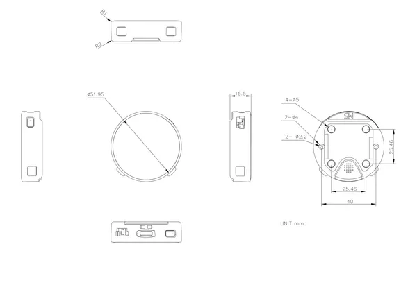
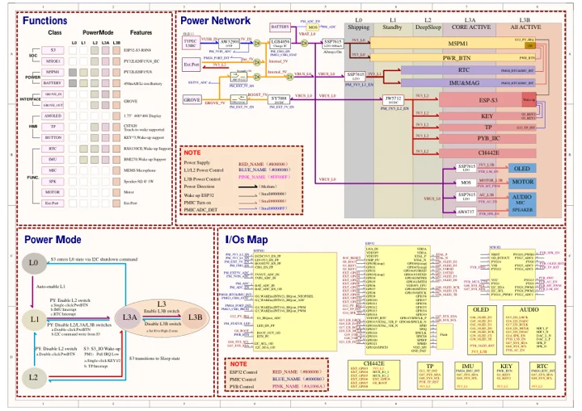

# StopWatch

**M5Stack** · Source collection

Revision: Unverified source identity

Coverage: Manufacturer references reviewed by scope; independent electrical and all-connector review pending

[Browse all manufacturers](../../../../BROWSE.md) · [Devices & IoT](../../../../DEVICES.md) · [Open in the browser guide](https://valleytech-black-wire-guide.pages.dev/?board=source-board-e457087f1495af50c8)

## Datasheets and original documentation

Board datasheet: **not yet recorded**. Visual reference: **available**.

[Manufacturer hardware documentation](https://docs.m5stack.com/en/core/StopWatch)

- **schematic / board**: [StopWatch Schematics PDF](https://m5stack-doc.oss-cn-shenzhen.aliyuncs.com/1242/C152-SCH_Stopwatch_PRJ_Main_VA_20251201_2026_04_24_17_46_22.pdf) · [saved document](../../../../library/media/8d4755c341f966a6191f9f16a7a45c558a99749a5e39a30d0513f86a5e10ef80.pdf)
- **hardware-guide / board**: [Manufacturer pin and hardware documentation](https://docs.m5stack.com/en/core/StopWatch) · online

A chip datasheet, schematic and board datasheet have different scopes. Match the exact hardware revision.

[Documentation coverage and remaining gaps](../../../../DOCUMENTATION.md)

## Dimensions

**source reference** · Unreviewed source · PNG

[Open original reference](../../../../library/media/9954430989a47b5968087eae2f05e26231d103e0c5a62e817fa7a2c04a5350ea.png)

**Credit and rights:** Source rights not yet established. Source/manufacturer: M5Stack.

[Source 1](https://m5stack-doc.oss-cn-shenzhen.aliyuncs.com/1242/C152-StopWatch-model-size_page_01.png) · [Source 2](https://docs.m5stack.com/en/core/StopWatch)

Original source index: Dimensions. This file is searchable but has not been promoted to a reviewed physical board pinout.

Image revision: Not identified

SHA-256: `9954430989a47b5968087eae2f05e26231d103e0c5a62e817fa7a2c04a5350ea`

## StopWatch Schematics PDF

**original reference PDF** · Manufacturer source and first-page preview inspected; independent electrical and all-connector completeness review pending. · PDF

[Open original reference](../../../../library/media/8d4755c341f966a6191f9f16a7a45c558a99749a5e39a30d0513f86a5e10ef80.pdf)

**Credit and rights:** Manufacturer artwork; reuse and print rights not established. Inclusion does not relicense the original.. Source/manufacturer: M5Stack.

[Source 1](https://m5stack-doc.oss-cn-shenzhen.aliyuncs.com/1242/C152-SCH_Stopwatch_PRJ_Main_VA_20251201_2026_04_24_17_46_22.pdf) · [Source 2](https://docs.m5stack.com/en/core/StopWatch)

Manufacturer source retained unchanged. Manufacturer source and first-page preview inspected; independent electrical and all-connector completeness review pending.

Image revision: As supplied in the original; match exact board revision

SHA-256: `8d4755c341f966a6191f9f16a7a45c558a99749a5e39a30d0513f86a5e10ef80`

Pin assignments have not been independently electrically verified. Check board revision before wiring.
