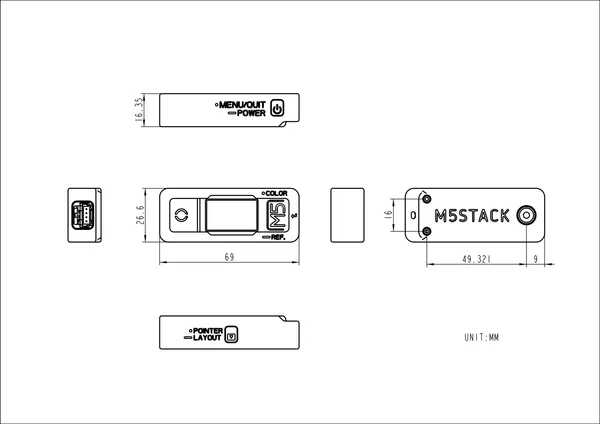

# T-Lite

**M5Stack** · Source collection

Revision: Unverified source identity  
Coverage: Source collection; review pending

[Browse all manufacturers](../../../../BROWSE.md) · [Desktop app](https://github.com/valleytechsolutions/black-wire-desktop)

## Dimensions

**source reference** · Unreviewed source · PNG

[Open original reference](../../../../library/media/58960f0f5d90f8feb627667dd157a2b65ebdf74376dfb3b93f7ad0a08224ecd1.png)

**Credit and rights:** Source rights not yet established. Source/manufacturer: M5Stack.

[Source 1](https://static-cdn.m5stack.com/resource/docs/products/app/T-Lite/img-1b2d5722-f7d5-4071-ad56-95ac848ee049.png) · [Source 2](https://docs.m5stack.com/en/app/T-Lite)

Original source index: Dimensions. This file is searchable but has not been promoted to a reviewed physical board pinout.

SHA-256: `58960f0f5d90f8feb627667dd157a2b65ebdf74376dfb3b93f7ad0a08224ecd1`

Pin assignments have not been independently electrically verified. Check board revision before wiring.
