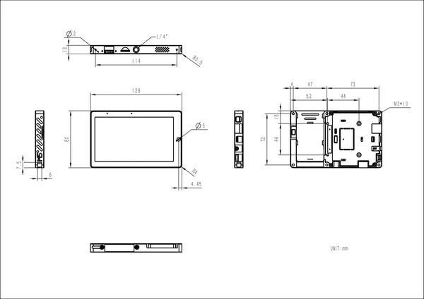
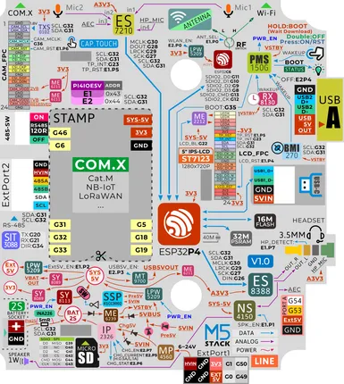
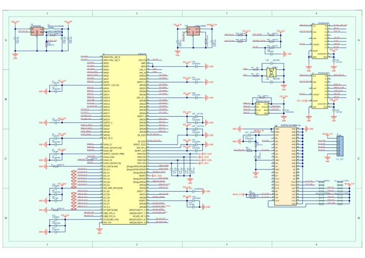

# Tab5

**M5Stack** · Source collection

Revision: Unverified source identity

Coverage: Manufacturer references reviewed by scope; independent electrical and all-connector review pending

[Browse all manufacturers](../../../../BROWSE.md) · [Devices & IoT](../../../../DEVICES.md) · [Open in the browser guide](https://valleytech-black-wire-guide.pages.dev/?board=source-board-f638cdc063642c1013)

## Datasheets and original documentation

Board datasheet: **not yet recorded**. Visual reference: **available**.

[Manufacturer hardware documentation](https://docs.m5stack.com/en/core/Tab5)

- **schematic / board**: [Tab5 Schematics PDF](https://m5stack-doc.oss-cn-shenzhen.aliyuncs.com/1132/Tab5_Schematics_PDF.pdf) · [saved document](../../../../library/media/13cf3fd9954d39aa198e57b1bb94ec56af7d49107c80a245acc5bd90ac8ea329.pdf)
- **hardware-guide / board**: [Manufacturer pin and hardware documentation](https://docs.m5stack.com/en/core/Tab5) · online

A chip datasheet, schematic and board datasheet have different scopes. Match the exact hardware revision.

[Documentation coverage and remaining gaps](../../../../DOCUMENTATION.md)

## Dimensions

**source reference** · Unreviewed source · PNG

[Open original reference](../../../../library/media/07f88cce34945190d8cddcab4b3adcb8ac415c83c20ac6a8f7ecf3d70c7032e6.png)

**Credit and rights:** Source rights not yet established. Source/manufacturer: M5Stack.

[Source 1](https://m5stack-doc.oss-cn-shenzhen.aliyuncs.com/1132/C145_Model_Size_page_01.png) · [Source 2](https://docs.m5stack.com/en/core/Tab5)

Original source index: Dimensions. This file is searchable but has not been promoted to a reviewed physical board pinout.

Image revision: Not identified

SHA-256: `07f88cce34945190d8cddcab4b3adcb8ac415c83c20ac6a8f7ecf3d70c7032e6`

## Tab5 Board PinMap Overview

**GPIO reference image** · Source identity and visual scope inspected; PDF review covers first-page preview. Independent electrical and all-connector completeness review pending. · PNG

[Open original reference](../../../../library/media/82ef49b176e53bf2cbd062cde416684d358e038f2486824c1d31618df197ea85.png)

**Credit and rights:** Manufacturer artwork; reuse and print rights not established. Inclusion does not relicense the original.. Source/manufacturer: M5Stack.

[Source 1](https://m5stack-doc.oss-cn-shenzhen.aliyuncs.com/1132/C145_Pinmap_Overview.png) · [Source 2](https://docs.m5stack.com/en/core/Tab5)

Manufacturer source retained unchanged. Source identity and visual scope inspected; PDF review covers first-page preview. Independent electrical and all-connector completeness review pending.

Image revision: As supplied in the original; match exact board revision

SHA-256: `82ef49b176e53bf2cbd062cde416684d358e038f2486824c1d31618df197ea85`

## Tab5 Schematics PDF

**original reference PDF** · Source identity and visual scope inspected; PDF review covers first-page preview. Independent electrical and all-connector completeness review pending. · PDF

[Open original reference](../../../../library/media/13cf3fd9954d39aa198e57b1bb94ec56af7d49107c80a245acc5bd90ac8ea329.pdf)

**Credit and rights:** Manufacturer artwork; reuse and print rights not established. Inclusion does not relicense the original.. Source/manufacturer: M5Stack.

[Source 1](https://m5stack-doc.oss-cn-shenzhen.aliyuncs.com/1132/Tab5_Schematics_PDF.pdf) · [Source 2](https://docs.m5stack.com/en/core/Tab5)

Manufacturer source retained unchanged. Source identity and visual scope inspected; PDF review covers first-page preview. Independent electrical and all-connector completeness review pending.

Image revision: As supplied in the original; match exact board revision

SHA-256: `13cf3fd9954d39aa198e57b1bb94ec56af7d49107c80a245acc5bd90ac8ea329`

Pin assignments have not been independently electrically verified. Check board revision before wiring.
