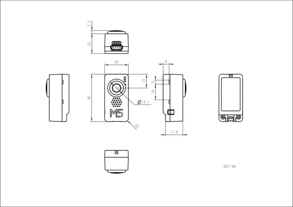

# TimerCamera-F

**M5Stack** · Source collection

Revision: Unverified source identity  
Coverage: Source collection; review pending

[Browse all manufacturers](../../../../BROWSE.md) · [Desktop app](https://github.com/valleytechsolutions/black-wire-desktop)

## Dimensions

**source reference** · Unreviewed source · PNG

[Open original reference](../../../../library/media/66f1edee42c75227bc5636e6469291424a955c09141a010a783a7a90897a9f55.png)

**Credit and rights:** Source rights not yet established. Source/manufacturer: M5Stack.

[Source 1](https://m5stack.oss-cn-shenzhen.aliyuncs.com/resource/docs/products/unit/timercam_f/186b42f289721cf96daafc4bb82737b.png) · [Source 2](https://docs.m5stack.com/en/unit/timercam_f)

Original source index: Dimensions. This file is searchable but has not been promoted to a reviewed physical board pinout.

SHA-256: `66f1edee42c75227bc5636e6469291424a955c09141a010a783a7a90897a9f55`

Pin assignments have not been independently electrically verified. Check board revision before wiring.
