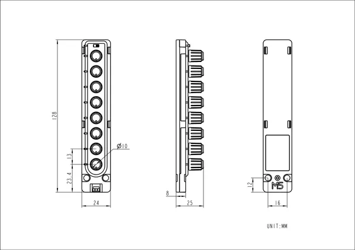

# Unit 8Encoder

**M5Stack** · Source collection

Revision: Unverified source identity

Coverage: Source collection; review pending

[Browse all manufacturers](../../../../BROWSE.md) · [Devices & IoT](../../../../DEVICES.md) · [Open in the browser guide](https://valleytech-black-wire-guide.pages.dev/?board=source-board-834f40b2126ac18fbc)

## Datasheets and original documentation

Board datasheet: **not yet recorded**. Visual reference: **available**.

[Manufacturer source (recorded link)](https://docs.m5stack.com/en/unit/8Encoder)

A chip datasheet, schematic and board datasheet have different scopes. Match the exact hardware revision.

[Documentation coverage and remaining gaps](../../../../DOCUMENTATION.md)

## Dimensions

**source reference** · Unreviewed source · PNG

[Open original reference](../../../../library/media/8f63277c68e8ff2d519ebe9f18c706ac5916f9a90e49c640b0b0dda91d5b61b3.png)

**Credit and rights:** Source rights not yet established. Source/manufacturer: M5Stack.

[Source 1](https://static-cdn.m5stack.com/resource/docs/products/unit/8Encoder/img-55ebb676-2b3c-4b9a-a192-b85bf0d1a87c.png) · [Source 2](https://docs.m5stack.com/en/unit/8Encoder)

Original source index: Dimensions. This file is searchable but has not been promoted to a reviewed physical board pinout.

Image revision: Not identified

SHA-256: `8f63277c68e8ff2d519ebe9f18c706ac5916f9a90e49c640b0b0dda91d5b61b3`

Pin assignments have not been independently electrically verified. Check board revision before wiring.
