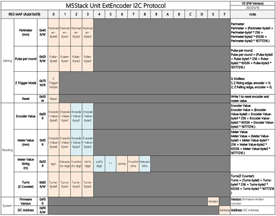

# Unit ExtEncoder

**M5Stack** · Source collection

Revision: Unverified source identity  
Coverage: Source collection; review pending

[Browse all manufacturers](../../../../BROWSE.md) · [Desktop app](https://github.com/valleytechsolutions/black-wire-desktop)

## Dimensions

**source reference** · Unreviewed source · JPG

[Open original reference](../../../../library/media/2ade64d0bda52f52453522b34884a9405b2db1f73e8057f381d7f1d1c37ffef4.jpg)

**Credit and rights:** Source rights not yet established. Source/manufacturer: M5Stack.

[Source 1](https://m5stack.oss-cn-shenzhen.aliyuncs.com/resource/docs/products/unit/ExtEncoder%20Unit/model%20size.jpg) · [Source 2](https://docs.m5stack.com/en/unit/ExtEncoder%20Unit)

Original source index: Dimensions. This file is searchable but has not been promoted to a reviewed physical board pinout.

SHA-256: `2ade64d0bda52f52453522b34884a9405b2db1f73e8057f381d7f1d1c37ffef4`

## Pinout

**source reference** · Unreviewed source · PNG

[Open original reference](../../../../library/media/dec98d2902c4697cce424d2e979db23511a23ff0ee6f60113b3245cb1d6cc700.png)

**Credit and rights:** Source rights not yet established. Source/manufacturer: M5Stack.

[Source 1](https://static-cdn.m5stack.com/resource/docs/products/unit/ExtEncoder Unit/arduinoCase-1683862277316pinmap.png) · [Source 2](https://docs.m5stack.com/en/unit/ExtEncoder%20Unit)

Original source index: Pinout. This file is searchable but has not been promoted to a reviewed physical board pinout.

SHA-256: `dec98d2902c4697cce424d2e979db23511a23ff0ee6f60113b3245cb1d6cc700`

Pin assignments have not been independently electrically verified. Check board revision before wiring.
