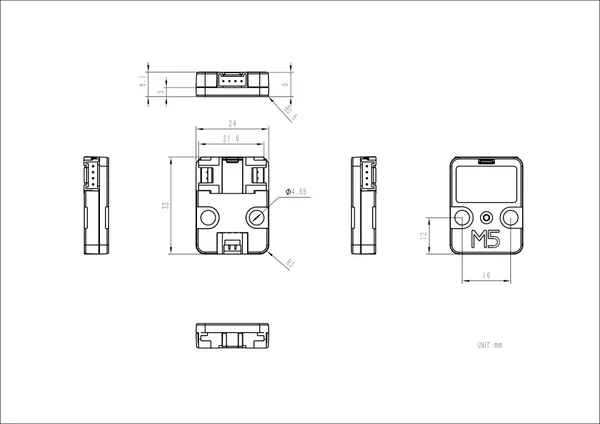

# Unit Grove to Grove

**M5Stack** · Source collection

Revision: Unverified source identity  
Coverage: Source collection; review pending

[Browse all manufacturers](../../../../BROWSE.md) · [Desktop app](https://github.com/valleytechsolutions/black-wire-desktop)

## Dimensions

**source reference** · Unreviewed source · JPG

[Open original reference](../../../../library/media/67f8a94797c7f5ff7bb9b811b701e7c96858fe930eb2048f8deb5a16ffbcb612.jpg)

**Credit and rights:** Source rights not yet established. Source/manufacturer: M5Stack.

[Source 1](https://m5stack.oss-cn-shenzhen.aliyuncs.com/resource/docs/products/unit/unit_grove2grove/model%20size.jpg) · [Source 2](https://docs.m5stack.com/en/unit/unit_grove2grove)

Original source index: Dimensions. This file is searchable but has not been promoted to a reviewed physical board pinout.

SHA-256: `67f8a94797c7f5ff7bb9b811b701e7c96858fe930eb2048f8deb5a16ffbcb612`

Pin assignments have not been independently electrically verified. Check board revision before wiring.
