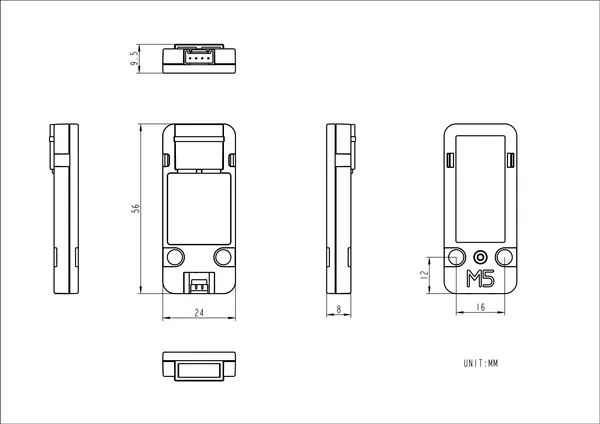

# Unit KMeter-ISO

**M5Stack** · Source collection

Revision: Unverified source identity  
Coverage: Source collection; review pending

[Browse all manufacturers](../../../../BROWSE.md) · [Desktop app](https://github.com/valleytechsolutions/black-wire-desktop)

## Dimensions

**source reference** · Unreviewed source · PNG

[Open original reference](../../../../library/media/524cb5d3baef7cc3a6ac6a7e2a588e80557fc9494c1788e148f427c43a30a9d2.png)

**Credit and rights:** Source rights not yet established. Source/manufacturer: M5Stack.

[Source 1](https://static-cdn.m5stack.com/resource/docs/products/unit/KMeterISO Unit/img-b09b086d-a26c-40d3-9ef5-f5f24a4e6028.png) · [Source 2](https://docs.m5stack.com/en/unit/KMeterISO%20Unit)

Original source index: Dimensions. This file is searchable but has not been promoted to a reviewed physical board pinout.

SHA-256: `524cb5d3baef7cc3a6ac6a7e2a588e80557fc9494c1788e148f427c43a30a9d2`

Pin assignments have not been independently electrically verified. Check board revision before wiring.
