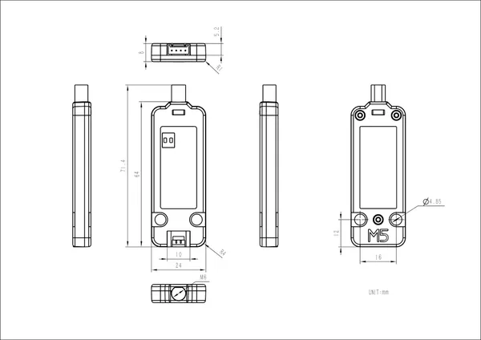

# Unit LoRaE220-433

**M5Stack** · Source collection

Revision: Unverified source identity

Coverage: Source collection; review pending

[Browse all manufacturers](../../../../BROWSE.md) · [Devices & IoT](../../../../DEVICES.md) · [Open in the browser guide](https://valleytech-black-wire-guide.pages.dev/?board=source-board-cfb352c345e0ddda30)

## Datasheets and original documentation

Board datasheet: **not yet recorded**. Visual reference: **available**.

[Manufacturer source (recorded link)](https://docs.m5stack.com/en/unit/Unit%20LoRaE220-433)

A chip datasheet, schematic and board datasheet have different scopes. Match the exact hardware revision.

[Documentation coverage and remaining gaps](../../../../DOCUMENTATION.md)

## Dimensions

**source reference** · Unreviewed source · JPG

[Open original reference](../../../../library/media/5e049c898baa3a1aa7c758a8128244518edee0ed8aab43e966e532a8747fee3d.jpg)

**Credit and rights:** Source rights not yet established. Source/manufacturer: M5Stack.

[Source 1](https://static-cdn.m5stack.com/resource/docs/products/unit/Unit LoRaE220-433/img-675ca98f-ee4c-4acf-8a83-540ce2ab7336.jpg) · [Source 2](https://docs.m5stack.com/en/unit/Unit%20LoRaE220-433)

Original source index: Dimensions. This file is searchable but has not been promoted to a reviewed physical board pinout.

Image revision: Not identified

SHA-256: `5e049c898baa3a1aa7c758a8128244518edee0ed8aab43e966e532a8747fee3d`

Pin assignments have not been independently electrically verified. Check board revision before wiring.
