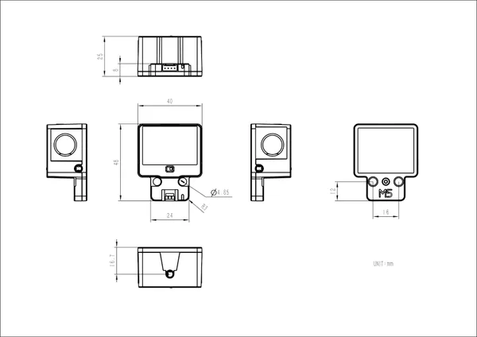

# Unit MIDI

**M5Stack** · Source collection

Revision: Unverified source identity  
Coverage: Source collection; review pending

[Browse all manufacturers](../../../../BROWSE.md) · [Desktop app](https://github.com/valleytechsolutions/black-wire-desktop)

## Dimensions

**source reference** · Unreviewed source · JPG

[Open original reference](../../../../library/media/442efbdcd92a23a32b7c54d0c9a2976b91a4b1568d55b17ce37a19c31a291b53.jpg)

**Credit and rights:** Source rights not yet established. Source/manufacturer: M5Stack.

[Source 1](https://static-cdn.m5stack.com/resource/docs/products/unit/Unit-MIDI/img-781316ed-8117-4315-bc6f-35cb02fac563.jpg) · [Source 2](https://docs.m5stack.com/en/unit/Unit-MIDI)

Original source index: Dimensions. This file is searchable but has not been promoted to a reviewed physical board pinout.

SHA-256: `442efbdcd92a23a32b7c54d0c9a2976b91a4b1568d55b17ce37a19c31a291b53`

Pin assignments have not been independently electrically verified. Check board revision before wiring.
