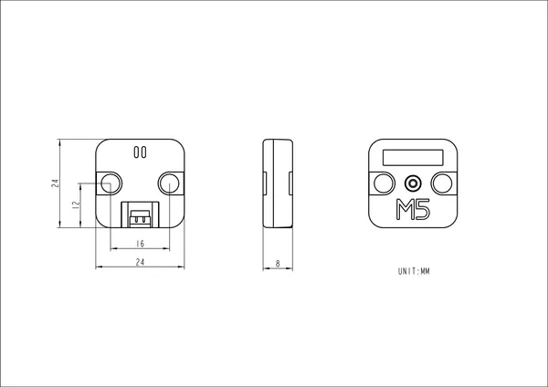

# Unit Mini BPS v1.1

**M5Stack** · Source collection

Revision: Unverified source identity  
Coverage: Source collection; review pending

[Browse all manufacturers](../../../../BROWSE.md) · [Desktop app](https://github.com/valleytechsolutions/black-wire-desktop)

## Dimensions

**source reference** · Unreviewed source · PNG

[Open original reference](../../../../library/media/90011a0615537782620fc9ab11835338a26f6686414e0352b448d4da58d54cf4.png)

**Credit and rights:** Source rights not yet established. Source/manufacturer: M5Stack.

[Source 1](https://static-cdn.m5stack.com/resource/docs/products/unit/BPS(QMP6988)/img-b2c73882-6358-4799-bec0-c5ca736dfc20.png) · [Source 2](https://docs.m5stack.com/en/unit/BPS(QMP6988))

Original source index: Dimensions. This file is searchable but has not been promoted to a reviewed physical board pinout.

SHA-256: `90011a0615537782620fc9ab11835338a26f6686414e0352b448d4da58d54cf4`

Pin assignments have not been independently electrically verified. Check board revision before wiring.
