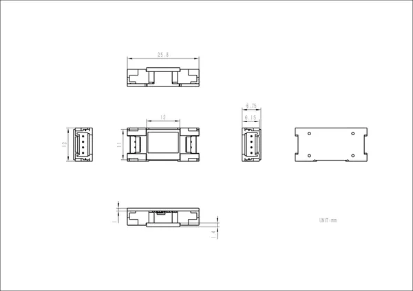

# Unit Mini OLED

**M5Stack** · Source collection

Revision: Unverified source identity

Coverage: Source collection; review pending

[Browse all manufacturers](../../../../BROWSE.md) · [Devices & IoT](../../../../DEVICES.md) · [Open in the browser guide](https://valleytech-black-wire-guide.pages.dev/?board=source-board-006d629d6c06146f9f)

## Datasheets and original documentation

Board datasheet: **not yet recorded**. Visual reference: **available**.

[Manufacturer source (recorded link)](https://docs.m5stack.com/en/unit/MiniOLED%20Unit)

A chip datasheet, schematic and board datasheet have different scopes. Match the exact hardware revision.

[Documentation coverage and remaining gaps](../../../../DOCUMENTATION.md)

## Dimensions

**source reference** · Unreviewed source · JPG

[Open original reference](../../../../library/media/2bc616562f18cc3396c39def8059f3d6e2a46594d5f72c09e6d16512435ad75e.jpg)

**Credit and rights:** Source rights not yet established. Source/manufacturer: M5Stack.

[Source 1](https://static-cdn.m5stack.com/resource/docs/products/unit/MiniOLED Unit/img-bd4c16f8-05f0-41d7-98a6-45d6405658ef.jpg) · [Source 2](https://docs.m5stack.com/en/unit/MiniOLED%20Unit)

Original source index: Dimensions. This file is searchable but has not been promoted to a reviewed physical board pinout.

Image revision: Not identified

SHA-256: `2bc616562f18cc3396c39def8059f3d6e2a46594d5f72c09e6d16512435ad75e`

Pin assignments have not been independently electrically verified. Check board revision before wiring.
