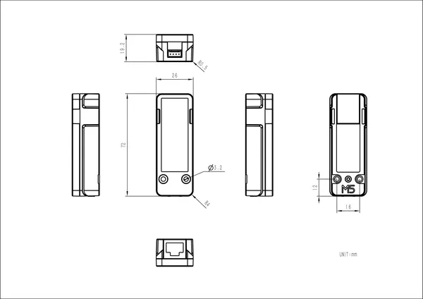

# Unit MQTT

**M5Stack** · Source collection

Revision: Unverified source identity  
Coverage: Source collection; review pending

[Browse all manufacturers](../../../../BROWSE.md) · [Desktop app](https://github.com/valleytechsolutions/black-wire-desktop)

## Dimensions

**source reference** · Unreviewed source · PNG

[Open original reference](../../../../library/media/2781fc3818b29fec2526ab8a016e1f6449f1822e51906a83e5336f3b0e0c094c.png)

**Credit and rights:** Source rights not yet established. Source/manufacturer: M5Stack.

[Source 1](https://m5stack-doc.oss-cn-shenzhen.aliyuncs.com/829/U129_Model_Size_page_01.png) · [Source 2](https://docs.m5stack.com/en/unit/mqtt)

Original source index: Dimensions. This file is searchable but has not been promoted to a reviewed physical board pinout.

SHA-256: `2781fc3818b29fec2526ab8a016e1f6449f1822e51906a83e5336f3b0e0c094c`

Pin assignments have not been independently electrically verified. Check board revision before wiring.
