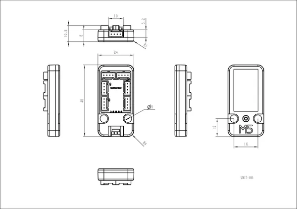

# Unit PaHub

**M5Stack** · Source collection

Revision: Unverified source identity  
Coverage: Source collection; review pending

[Browse all manufacturers](../../../../BROWSE.md) · [Desktop app](https://github.com/valleytechsolutions/black-wire-desktop)

## Dimensions

**source reference** · Unreviewed source · PNG

[Open original reference](../../../../library/media/78d6ddcc2ec86ec7d7f4d6302976c3cee28eee25aa3ae4fa4b9a63647f7bacb3.png)

**Credit and rights:** Source rights not yet established. Source/manufacturer: M5Stack.

[Source 1](https://m5stack-doc.oss-cn-shenzhen.aliyuncs.com/793/U040-B_Module_Size_sch_01.png) · [Source 2](https://docs.m5stack.com/en/unit/pahub)

Original source index: Dimensions. This file is searchable but has not been promoted to a reviewed physical board pinout.

SHA-256: `78d6ddcc2ec86ec7d7f4d6302976c3cee28eee25aa3ae4fa4b9a63647f7bacb3`

Pin assignments have not been independently electrically verified. Check board revision before wiring.
