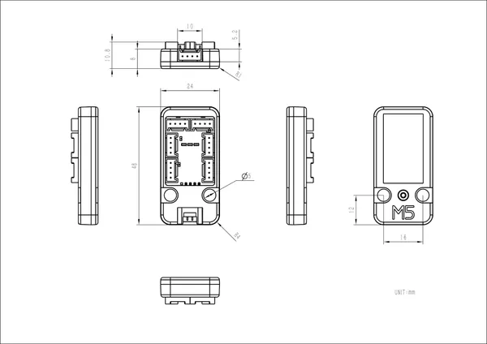

# Unit PaHub v2.1

**M5Stack** · Source collection

Revision: Unverified source identity  
Coverage: Source collection; review pending

[Browse all manufacturers](../../../../BROWSE.md) · [Desktop app](https://github.com/valleytechsolutions/black-wire-desktop)

## Dimensions

**source reference** · Unreviewed source · JPG

[Open original reference](../../../../library/media/5720fa4591ea8a2acbd2a82beeebe2c04d8b28ebb5419aa20d9f0423a37ea0bd.jpg)

**Credit and rights:** Source rights not yet established. Source/manufacturer: M5Stack.

[Source 1](https://m5stack.oss-cn-shenzhen.aliyuncs.com/resource/docs/products/unit/Unit-PaHub2.1/module%20size.jpg) · [Source 2](https://docs.m5stack.com/en/unit/Unit-PaHub%20v2.1)

Original source index: Dimensions. This file is searchable but has not been promoted to a reviewed physical board pinout.

SHA-256: `5720fa4591ea8a2acbd2a82beeebe2c04d8b28ebb5419aa20d9f0423a37ea0bd`

Pin assignments have not been independently electrically verified. Check board revision before wiring.
