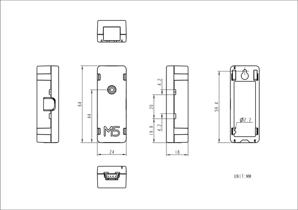

# Unit PoE CAM-W

**M5Stack** · Source collection

Revision: Unverified source identity  
Coverage: Source collection; review pending

[Browse all manufacturers](../../../../BROWSE.md) · [Desktop app](https://github.com/valleytechsolutions/black-wire-desktop)

## Dimensions

**source reference** · Unreviewed source · PNG

[Open original reference](../../../../library/media/f935fceba76d2d63379f6f5eb48a04213091b7b39523af4d3f89828842058059.png)

**Credit and rights:** Source rights not yet established. Source/manufacturer: M5Stack.

[Source 1](https://static-cdn.m5stack.com/resource/docs/products/unit/PoECAM-W/img-047019da-7c82-4641-8769-392f845222f4.png) · [Source 2](https://docs.m5stack.com/en/unit/PoECAM-W)

Original source index: Dimensions. This file is searchable but has not been promoted to a reviewed physical board pinout.

SHA-256: `f935fceba76d2d63379f6f5eb48a04213091b7b39523af4d3f89828842058059`

Pin assignments have not been independently electrically verified. Check board revision before wiring.
