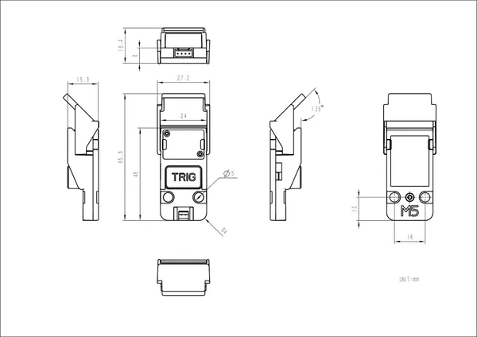

# Unit QRCode

**M5Stack** · Source collection

Revision: Unverified source identity  
Coverage: Source collection; review pending

[Browse all manufacturers](../../../../BROWSE.md) · [Desktop app](https://github.com/valleytechsolutions/black-wire-desktop)

## Dimensions

**source reference** · Unreviewed source · JPG

[Open original reference](../../../../library/media/1fd125abe3fae7ec5b664f8a311634ce585d8f483afcf31780fecbfd8fcebfb1.jpg)

**Credit and rights:** Source rights not yet established. Source/manufacturer: M5Stack.

[Source 1](https://static-cdn.m5stack.com/resource/docs/products/unit/Unit-QRCode/img-3bc3b2bd-e524-40fa-93e9-e82489c050c3.jpg) · [Source 2](https://docs.m5stack.com/en/unit/Unit-QRCode)

Original source index: Dimensions. This file is searchable but has not been promoted to a reviewed physical board pinout.

SHA-256: `1fd125abe3fae7ec5b664f8a311634ce585d8f483afcf31780fecbfd8fcebfb1`

Pin assignments have not been independently electrically verified. Check board revision before wiring.
