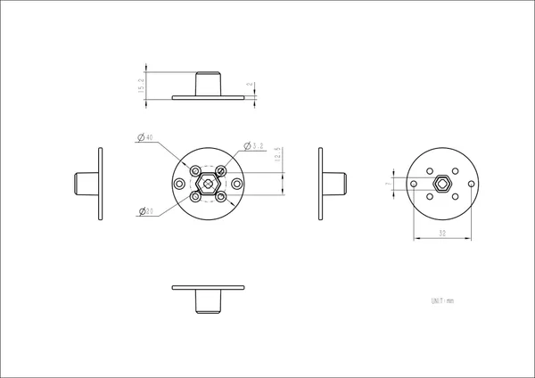
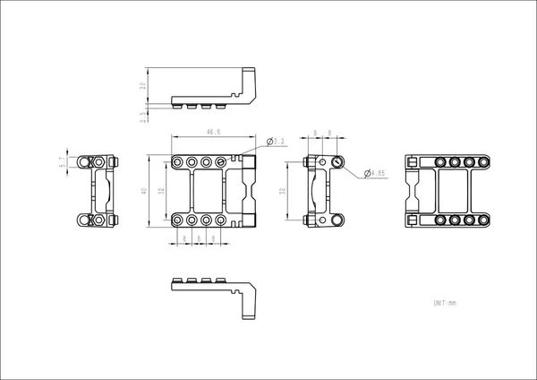
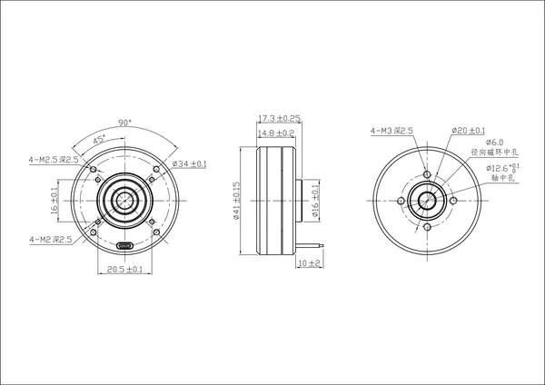
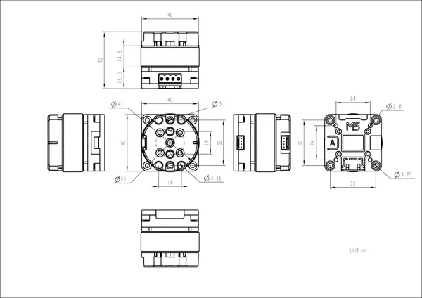

# Unit Roller485

**M5Stack** · Source collection

Revision: Unverified source identity  
Coverage: Source collection; review pending

[Browse all manufacturers](../../../../BROWSE.md) · [Desktop app](https://github.com/valleytechsolutions/black-wire-desktop)

## Dimensions

**source reference** · Unreviewed source · JPG

[Open original reference](../../../../library/media/b9410bc2bcbb79cf438222af9b2138fb11db22e055ac36b25be42585793095a9.jpg)

**Credit and rights:** Source rights not yet established. Source/manufacturer: M5Stack.

[Source 1](https://m5stack.oss-cn-shenzhen.aliyuncs.com/resource/docs/products/unit/Unit-Roller485/%E5%B0%BA%E5%AF%B8%E5%9B%BE2.jpg) · [Source 2](https://docs.m5stack.com/en/unit/Unit-Roller485)

Original source index: Dimensions. This file is searchable but has not been promoted to a reviewed physical board pinout.

SHA-256: `b9410bc2bcbb79cf438222af9b2138fb11db22e055ac36b25be42585793095a9`

## Dimensions

**source reference** · Unreviewed source · JPG

[Open original reference](../../../../library/media/7c3cabf5f5de0fd772d98d51b86b09f51022ee27d2350fd31a6a1eb26cd794e7.jpg)

**Credit and rights:** Source rights not yet established. Source/manufacturer: M5Stack.

[Source 1](https://m5stack.oss-cn-shenzhen.aliyuncs.com/resource/docs/products/unit/Unit-Roller485/%E5%B0%BA%E5%AF%B8%E5%9B%BE3.jpg) · [Source 2](https://docs.m5stack.com/en/unit/Unit-Roller485)

Original source index: Dimensions. This file is searchable but has not been promoted to a reviewed physical board pinout.

SHA-256: `7c3cabf5f5de0fd772d98d51b86b09f51022ee27d2350fd31a6a1eb26cd794e7`

## Dimensions

**source reference** · Unreviewed source · PNG

[Open original reference](../../../../library/media/e3f8ee409fc06d487e4ae316b9270aeb7252c9c15a32a3a341f1d9552c5a22d6.png)

**Credit and rights:** Source rights not yet established. Source/manufacturer: M5Stack.

[Source 1](https://m5stack-doc.oss-cn-shenzhen.aliyuncs.com/776/modelsize_01.png) · [Source 2](https://docs.m5stack.com/en/unit/Unit-Roller485)

Original source index: Dimensions. This file is searchable but has not been promoted to a reviewed physical board pinout.

SHA-256: `e3f8ee409fc06d487e4ae316b9270aeb7252c9c15a32a3a341f1d9552c5a22d6`

## Dimensions

**source reference** · Unreviewed source · JPG

[Open original reference](../../../../library/media/443997d6d9d6a1d303edfb7892531c9c838962f692c3085604b63a9115d34873.jpg)

**Credit and rights:** Source rights not yet established. Source/manufacturer: M5Stack.

[Source 1](https://m5stack.oss-cn-shenzhen.aliyuncs.com/resource/docs/products/unit/Unit-Roller485/%E5%B0%BA%E5%AF%B8%E5%9B%BE.jpg) · [Source 2](https://docs.m5stack.com/en/unit/Unit-Roller485)

Original source index: Dimensions. This file is searchable but has not been promoted to a reviewed physical board pinout.

SHA-256: `443997d6d9d6a1d303edfb7892531c9c838962f692c3085604b63a9115d34873`

Pin assignments have not been independently electrically verified. Check board revision before wiring.
