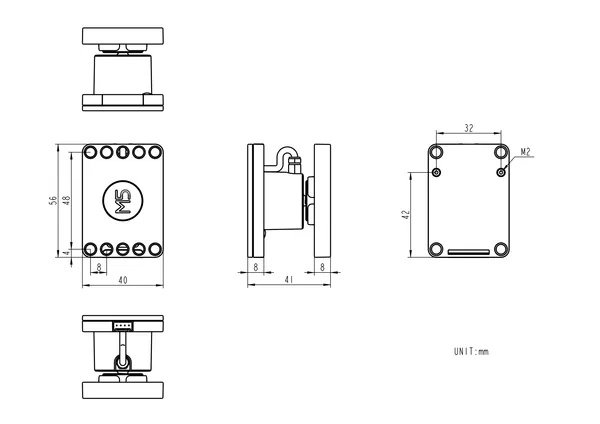

# Unit Scales

**M5Stack** · Source collection

Revision: Unverified source identity  
Coverage: Source collection; review pending

[Browse all manufacturers](../../../../BROWSE.md) · [Desktop app](https://github.com/valleytechsolutions/black-wire-desktop)

## Dimensions

**source reference** · Unreviewed source · PNG

[Open original reference](../../../../library/media/88d15726550eb8b1219b7cdfa7a14521c329f68abdfc92ac55b899c379dfc130.png)

**Credit and rights:** Source rights not yet established. Source/manufacturer: M5Stack.

[Source 1](https://static-cdn.m5stack.com/resource/docs/products/unit/UNIT Scales/img-18e45241-a9b7-4d70-ab63-ba93b7473f18.png) · [Source 2](https://docs.m5stack.com/en/unit/UNIT%20Scales)

Original source index: Dimensions. This file is searchable but has not been promoted to a reviewed physical board pinout.

SHA-256: `88d15726550eb8b1219b7cdfa7a14521c329f68abdfc92ac55b899c379dfc130`

Pin assignments have not been independently electrically verified. Check board revision before wiring.
