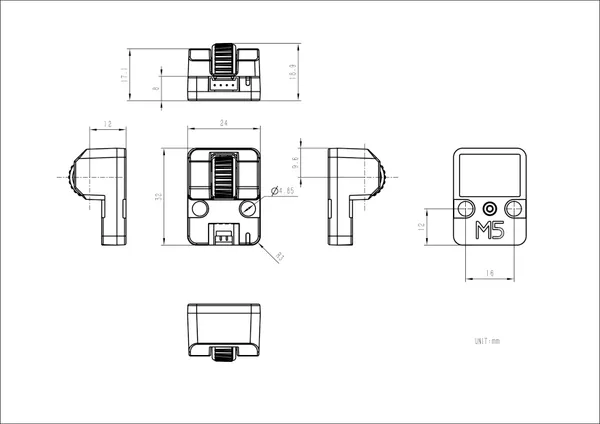

# Unit Scroll

**M5Stack** · Source collection

Revision: Unverified source identity  
Coverage: Source collection; review pending

[Browse all manufacturers](../../../../BROWSE.md) · [Desktop app](https://github.com/valleytechsolutions/black-wire-desktop)

## Dimensions

**source reference** · Unreviewed source · JPG

[Open original reference](../../../../library/media/abc5f5ea99f9d9de25bd430a43f371c7bd2514c9ba31acf01dd7cf97ade7bce9.jpg)

**Credit and rights:** Source rights not yet established. Source/manufacturer: M5Stack.

[Source 1](https://static-cdn.m5stack.com/resource/docs/products/unit/UNIT-Scroll/img-4ec8cc89-5f89-401c-80a9-4e0c27c9f36e.jpg) · [Source 2](https://docs.m5stack.com/en/unit/UNIT-Scroll)

Original source index: Dimensions. This file is searchable but has not been promoted to a reviewed physical board pinout.

SHA-256: `abc5f5ea99f9d9de25bd430a43f371c7bd2514c9ba31acf01dd7cf97ade7bce9`

Pin assignments have not been independently electrically verified. Check board revision before wiring.
