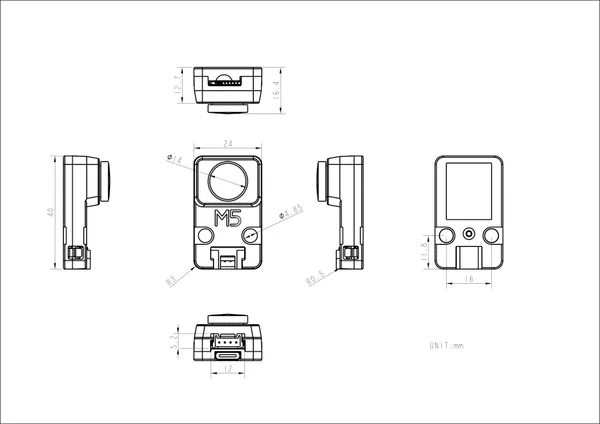

# UnitV-M12

**M5Stack** · Source collection

Revision: Unverified source identity  
Coverage: Source collection; review pending

[Browse all manufacturers](../../../../BROWSE.md) · [Desktop app](https://github.com/valleytechsolutions/black-wire-desktop)

## Dimensions

**source reference** · Unreviewed source · JPG

[Open original reference](../../../../library/media/d8f0f4e5364d364fc60abdc2f0d17cb7177b48c8d5a1baa4823db44d08c600cb.jpg)

**Credit and rights:** Source rights not yet established. Source/manufacturer: M5Stack.

[Source 1](https://static-cdn.m5stack.com/resource/docs/products/unit/UNIT-V M12/img-0463d15d-73b2-4f6a-904d-20676f8a3197.jpg) · [Source 2](https://docs.m5stack.com/en/unit/UNIT-V%20M12)

Original source index: Dimensions. This file is searchable but has not been promoted to a reviewed physical board pinout.

SHA-256: `d8f0f4e5364d364fc60abdc2f0d17cb7177b48c8d5a1baa4823db44d08c600cb`

Pin assignments have not been independently electrically verified. Check board revision before wiring.
