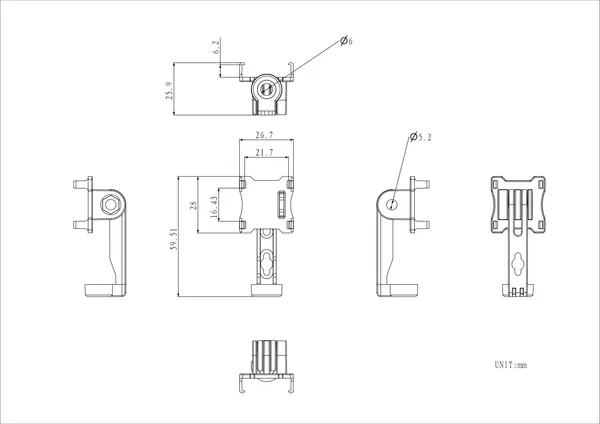
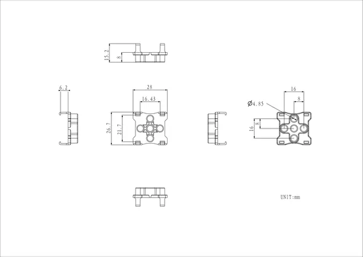
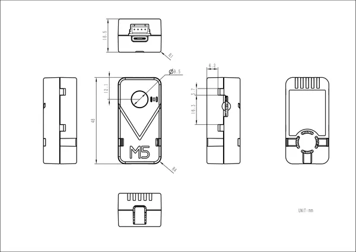

# UnitV2

**M5Stack** · Source collection

Revision: Unverified source identity

Coverage: Source collection; review pending

[Browse all manufacturers](../../../../BROWSE.md) · [Devices & IoT](../../../../DEVICES.md) · [Open in the browser guide](https://valleytech-black-wire-guide.pages.dev/?board=source-board-b6cf96dfe427e79e40)

## Datasheets and original documentation

Board datasheet: **not yet recorded**. Visual reference: **available**.

[Manufacturer source (recorded link)](https://docs.m5stack.com/en/unit/unitv2)

A chip datasheet, schematic and board datasheet have different scopes. Match the exact hardware revision.

[Documentation coverage and remaining gaps](../../../../DOCUMENTATION.md)

## Dimensions

**source reference** · Unreviewed source · PNG

[Open original reference](../../../../library/media/a37dc8d8ee6e297b1e97d361e964275e4b7092db74467a29412d055a569a0551.png)

**Credit and rights:** Source rights not yet established. Source/manufacturer: M5Stack.

[Source 1](https://m5stack-doc.oss-cn-shenzhen.aliyuncs.com/1051/U078-D_UnitV2_model_size_STAND_page_01.png) · [Source 2](https://docs.m5stack.com/en/unit/unitv2)

Original source index: Dimensions. This file is searchable but has not been promoted to a reviewed physical board pinout.

Image revision: Not identified

SHA-256: `a37dc8d8ee6e297b1e97d361e964275e4b7092db74467a29412d055a569a0551`

## Dimensions

**source reference** · Unreviewed source · PNG

[Open original reference](../../../../library/media/6f3e5d392b99ae64239ff853092c03452f803e5bbfc4623c3f91ec91ad5a5503.png)

**Credit and rights:** Source rights not yet established. Source/manufacturer: M5Stack.

[Source 1](https://m5stack-doc.oss-cn-shenzhen.aliyuncs.com/1051/U078-D_UnitV2_model_size_BACK-BRICK_page_01.png) · [Source 2](https://docs.m5stack.com/en/unit/unitv2)

Original source index: Dimensions. This file is searchable but has not been promoted to a reviewed physical board pinout.

Image revision: Not identified

SHA-256: `6f3e5d392b99ae64239ff853092c03452f803e5bbfc4623c3f91ec91ad5a5503`

## Dimensions

**source reference** · Unreviewed source · PNG

[Open original reference](../../../../library/media/21993433cfa640dc3c9179d1f08aefae7030d8436522badeaeb58ac0b0bae548.png)

**Credit and rights:** Source rights not yet established. Source/manufacturer: M5Stack.

[Source 1](https://m5stack-doc.oss-cn-shenzhen.aliyuncs.com/1051/U078-D_Model_Size_page_01.png) · [Source 2](https://docs.m5stack.com/en/unit/unitv2)

Original source index: Dimensions. This file is searchable but has not been promoted to a reviewed physical board pinout.

Image revision: Not identified

SHA-256: `21993433cfa640dc3c9179d1f08aefae7030d8436522badeaeb58ac0b0bae548`

Pin assignments have not been independently electrically verified. Check board revision before wiring.
