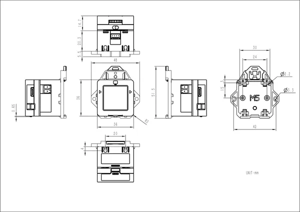

# VAMeter

**M5Stack** · Source collection

Revision: Unverified source identity  
Coverage: Source collection; review pending

[Browse all manufacturers](../../../../BROWSE.md) · [Desktop app](https://github.com/valleytechsolutions/black-wire-desktop)

## Dimensions

**source reference** · Unreviewed source · PNG

[Open original reference](../../../../library/media/e8b13836ec198143bd3eab19d48e53d98c1b42f513e54bbf1e6db8c8e96f5907.png)

**Credit and rights:** Source rights not yet established. Source/manufacturer: M5Stack.

[Source 1](https://m5stack.oss-cn-shenzhen.aliyuncs.com/resource/docs/products/core/VA%20Meter/7658e330231814126dd64b55760eaea.png) · [Source 2](https://docs.m5stack.com/en/core/VA%20Meter)

Original source index: Dimensions. This file is searchable but has not been promoted to a reviewed physical board pinout.

SHA-256: `e8b13836ec198143bd3eab19d48e53d98c1b42f513e54bbf1e6db8c8e96f5907`

Pin assignments have not been independently electrically verified. Check board revision before wiring.
