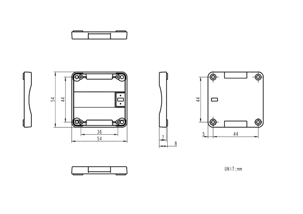

# Watch Dev Kit v1.1

**M5Stack** · Source collection

Revision: Unverified source identity  
Coverage: Source collection; review pending

[Browse all manufacturers](../../../../BROWSE.md) · [Desktop app](https://github.com/valleytechsolutions/black-wire-desktop)

## Dimensions

**source reference** · Unreviewed source · PNG

[Open original reference](../../../../library/media/5c4851f7a9f54c9c3f1d3b52a3d15afd073dff33ba3c05b640174ac05ee3a8f9.png)

**Credit and rights:** Source rights not yet established. Source/manufacturer: M5Stack.

[Source 1](https://static-cdn.m5stack.com/resource/docs/products/accessory/WATCH v1.1 Dev Kit/img-68bdb0fb-b503-4033-8dfb-7b4e037ee73d.png) · [Source 2](https://docs.m5stack.com/en/accessory/WATCH%20v1.1%20Dev%20Kit)

Original source index: Dimensions. This file is searchable but has not been promoted to a reviewed physical board pinout.

SHA-256: `5c4851f7a9f54c9c3f1d3b52a3d15afd073dff33ba3c05b640174ac05ee3a8f9`

Pin assignments have not been independently electrically verified. Check board revision before wiring.
