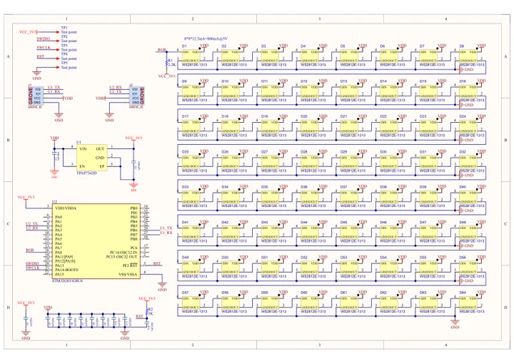

# Chain RGB

**M5Stack** · STM32G031G8U6

Revision: Match revision in each original source

Coverage: Manufacturer references reviewed by scope; independent electrical and all-connector review pending

[Browse all manufacturers](../../../../BROWSE.md) · [Devices & IoT](../../../../DEVICES.md) · [Open in the browser guide](https://valleytech-black-wire-guide.pages.dev/?board=m5stack-chain-rgb)

## Datasheets and original documentation

Board datasheet: **not yet recorded**. Visual reference: **available**.

[Manufacturer hardware documentation](https://docs.m5stack.com/en/chain/Chain_RGB)

- **schematic / board**: [Chain RGB Schematics PDF](https://m5stack-doc.oss-cn-shenzhen.aliyuncs.com/1252/SCH_Chain_RGB_2026_04_02_10_35_51.pdf) · [saved document](../../../../library/media/35dc35183747dc7da279f05defcac93d7bef282c9df6c3a0cde19c4184cd43fc.pdf)
- **hardware-guide / board**: [Manufacturer pin and hardware documentation](https://docs.m5stack.com/en/chain/Chain_RGB) · online

A chip datasheet, schematic and board datasheet have different scopes. Match the exact hardware revision.

[Documentation coverage and remaining gaps](../../../../DOCUMENTATION.md)

## Chain RGB Schematics PDF

**original reference PDF** · Manufacturer source and first-page preview inspected; electrical correctness and all-connector completeness not independently approved. · PDF

[Open original reference](../../../../library/media/35dc35183747dc7da279f05defcac93d7bef282c9df6c3a0cde19c4184cd43fc.pdf)

**Credit and rights:** Manufacturer artwork; reuse and print rights not established. Inclusion does not relicense the original.. Source/manufacturer: M5Stack.

[Source 1](https://m5stack-doc.oss-cn-shenzhen.aliyuncs.com/1252/SCH_Chain_RGB_2026_04_02_10_35_51.pdf) · [Source 2](https://docs.m5stack.com/en/chain/Chain_RGB)

Manufacturer source retained unchanged. Manufacturer source and first-page preview inspected; electrical correctness and all-connector completeness not independently approved.

Image revision: As supplied in the original; match exact board revision

SHA-256: `35dc35183747dc7da279f05defcac93d7bef282c9df6c3a0cde19c4184cd43fc`

Pin assignments have not been independently electrically verified. Check board revision before wiring.
