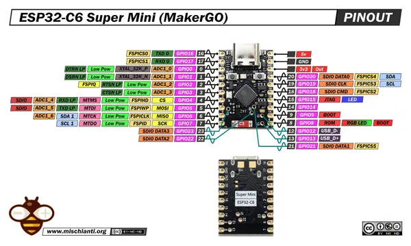

# Maker Go ESP32C6 Supermini

**Maker Go** · ESP32-C6

Revision: Not identified  
Coverage: Pinout image collected

[Browse all manufacturers](../../../../BROWSE.md) · [Desktop app](https://github.com/valleytechsolutions/black-wire-desktop)

## Pinout - Renzo Mischianti

**pinout image** · Reviewed source · JPG

[Open original reference](../../../../library/media/36cf3ab8d6c879cf736038aa3bc64068837bc9a1761ae329f05df6f57c6e7931.jpg)

**Credit and rights:** CC BY-NC-ND marking visible on image; exact license version and publication permissions not established. Source/manufacturer: Maker Go.

[Source 1](https://mischianti.org/wp-content/uploads/2026/04/esp32-c6-supermini-MakerGO-low-pinout.jpg) · [Source 2](https://mischianti.org/esp32-c6-supermini-high-resolution-pinout-datasheet-schema-and-specs/)

Original public image by Renzo Mischianti, unchanged. Diagram/model matching is visual, not electrical verification. Exact PCB layout and revision must match; no inference of compatibility with lookalike marketplace clones. MakerGO attribution is printed by the diagram author; this is not independent verification of a marketplace seller.

SHA-256: `36cf3ab8d6c879cf736038aa3bc64068837bc9a1761ae329f05df6f57c6e7931`

Pin assignments have not been independently electrically verified. Check board revision before wiring.
