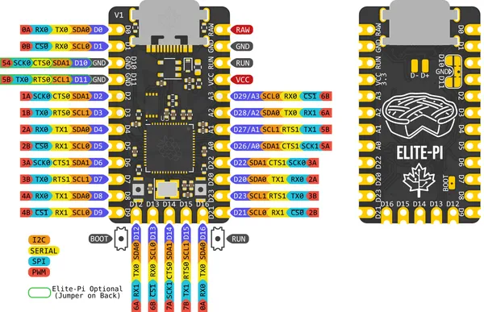

# Maple Elite-Pi

**Maple** · RP2040

Revision: Not identified  
Coverage: Pinout image collected

[Browse all manufacturers](../../../../BROWSE.md) · [Desktop app](https://github.com/valleytechsolutions/black-wire-desktop)

## Physical board pinout

**pinout image** · Reviewed source · PNG

[Open original reference](../../../../library/media/ca0d8703cee36330a57d3b835bfce031319ccbe4e1b9d8fa1e6bbee26728377d.png)

**Credit and rights:** Not established; source attribution retained. Source/manufacturer: Maple.

[Source 1](https://keeb.io/cdn/shop/files/Elite-Pi_Pinout-Both.png?v=1724725813) · [Source 2](https://keeb.io/products/elite-pi-usb-c-pro-micro-replacement-rp2040)

Discovered from CircuitPython board metadata and the linked product/documentation page. Exact hardware revision requires matching to the diagram.

SHA-256: `ca0d8703cee36330a57d3b835bfce031319ccbe4e1b9d8fa1e6bbee26728377d`

Pin assignments have not been independently electrically verified. Check board revision before wiring.
