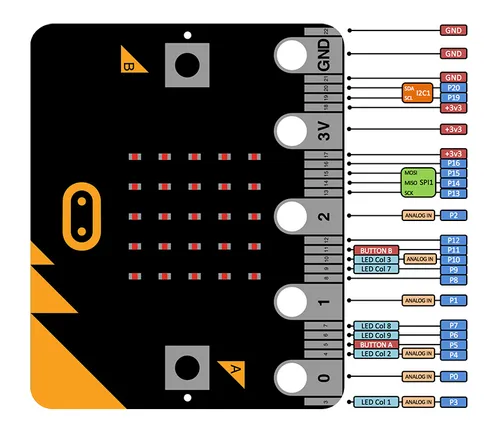

# Micro:bit

**micro-bit Educational Foundation** · Other

Revision: Not identified  
Coverage: Pinout image collected

[Browse all manufacturers](../../../../BROWSE.md) · [Desktop app](https://github.com/valleytechsolutions/black-wire-desktop)

## Pinout

**pinout image** · Reviewed source · JPG

[Open original reference](../../../../library/media/da43bdb7dcc2ca61147f0379af1c6dc7475fddf31ca3d385166d7133e819e0c4.jpg)

**Credit and rights:** Not recorded; retain original attribution. Source/manufacturer: micro-bit Educational Foundation.

[Source 1](https://www.waveshare.com/img/devkit/Micro-bit/Micro-bit-Pinout.jpg) · [Source 2](https://www.waveshare.com/micro-bit.htm)

SHA-256: `da43bdb7dcc2ca61147f0379af1c6dc7475fddf31ca3d385166d7133e819e0c4`

Pin assignments have not been independently electrically verified. Check board revision before wiring.
