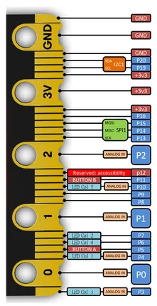

# Micro:bit V2

**micro-bit Educational Foundation** · Other

Revision: Not identified  
Coverage: Pinout image collected

[Browse all manufacturers](../../../../BROWSE.md) · [Desktop app](https://github.com/valleytechsolutions/black-wire-desktop)

## Edge connector

**pinout image** · Reviewed source · PNG

[Open original reference](../../../../library/media/43051f7be0aeb57a3ebae2deb17c040b592c7eb349942b36fe406134e1f4a793.png) · [Original vector](../../../../library/media/bccba2469a9afd23e9e0e1f746dfb876e232d954bd636bb516aa4a4500fcdc3c.svg)

**Credit and rights:** Not recorded by source. Source/manufacturer: micro-bit Educational Foundation.

[Source 1](https://tech.microbit.org/docs/hardware/assets/edge-connector-2.svg) · [Source 2](https://tech.microbit.org/hardware/edgeconnector/) · [Source 3](https://www.waveshare.com/wiki/Micro:bit_V2)

Official V2 edge connector SVG rendered to PNG on a white page. Original SVG retained as a companion file.

SHA-256: `43051f7be0aeb57a3ebae2deb17c040b592c7eb349942b36fe406134e1f4a793`

Pin assignments have not been independently electrically verified. Check board revision before wiring.
