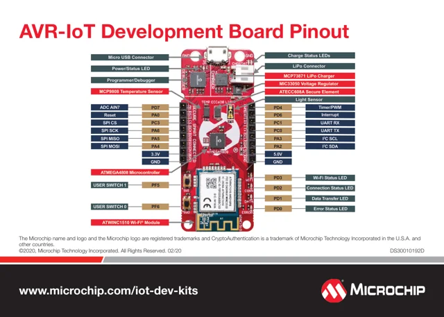

# AVR-IoT WG / AC164160

**Microchip** · ATmega4808

Revision: Not identified

Coverage: Physical pinout reference; independent completeness review pending

[Browse all manufacturers](../../../../BROWSE.md) · [Devices & IoT](../../../../DEVICES.md) · [Open in the browser guide](https://valleytech-black-wire-guide.pages.dev/?board=microchip-avr-iot-wg)

Architecture: **AVR**

## Datasheets and original documentation

Board datasheet: **not yet recorded**. Visual reference: **available**.

[Original manufacturer product documentation](https://www.microchip.com/en-us/development-tool/AC164160)

- **hardware-guide / board**: [Manufacturer hardware guide / connector reference](https://ww1.microchip.com/downloads/en/DeviceDoc/30010192D.pdf) · [saved document](../../../../library/media/6d093e8edb1605a25f8ec2ba1559076ba6d435a629d46817ea43a1a9cc9d6735.pdf)

Original source reviewed for model and visual type. Pin assignments and electrical limits have not been independently verified. Match the PCB revision before wiring.

[Documentation coverage and remaining gaps](../../../../DOCUMENTATION.md)

## Specifications and hardware documentation

- [Original model specifications](https://www.microchip.com/en-us/development-tool/AC164160)

## Original manufacturer hardware guide

**original reference PDF** · Reviewed source · PDF

[Open original reference](../../../../library/media/6d093e8edb1605a25f8ec2ba1559076ba6d435a629d46817ea43a1a9cc9d6735.pdf)

**Credit and rights:** Microchip / original artwork contributors. Asset-specific redistribution and print rights are not established. Black Wire's editorial license does not relicense this artwork.. Source/manufacturer: Microchip.

[Source 1](https://ww1.microchip.com/downloads/en/DeviceDoc/30010192D.pdf) · [Source 2](https://www.microchip.com/en-us/development-tool/AC164160)

Original source reviewed for model and visual type. Pin assignments and electrical limits have not been independently verified. Match the PCB revision before wiring.

Image revision: Not identified

SHA-256: `6d093e8edb1605a25f8ec2ba1559076ba6d435a629d46817ea43a1a9cc9d6735`

## Manufacturer GPIO / connector reference — page 2

**pinout image** · Reviewed source · PNG

[Open original reference](../../../../library/media/d37c6440d853f0f37a3687390c7751f92ca462420c2c263cdc6eb701f56ed063.png)

**Credit and rights:** Microchip / original artwork contributors. Asset-specific redistribution and print rights are not established. Black Wire's editorial license does not relicense this artwork.. Source/manufacturer: Microchip.

[Source 1](https://ww1.microchip.com/downloads/en/DeviceDoc/30010192D.pdf) · [Source 2](https://www.microchip.com/en-us/development-tool/AC164160)

Original source reviewed for model and visual type. Pin assignments and electrical limits have not been independently verified. Match the PCB revision before wiring.

Image revision: Not identified

SHA-256: `d37c6440d853f0f37a3687390c7751f92ca462420c2c263cdc6eb701f56ed063`

Pin assignments have not been independently electrically verified. Check board revision before wiring.
