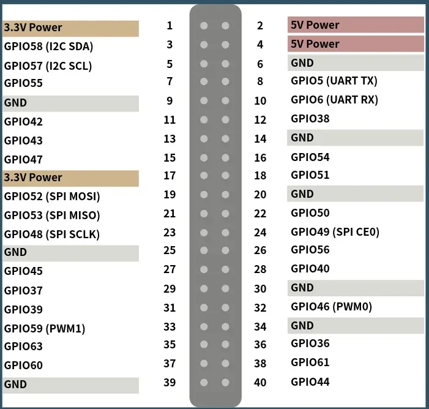

# Mars

**Milk-V** · JH7110

Revision: Not identified

Coverage: Physical pinout source collected; scope and revision require confirmation

[Browse all manufacturers](../../../../BROWSE.md) · [Devices & IoT](../../../../DEVICES.md) · [Open in the browser guide](https://valleytech-black-wire-guide.pages.dev/?board=milk-v-mars)

Architecture: **RISC-V**

## Specifications and hardware documentation

- [Specifications & hardware guide](https://milkv.io/docs/mars/getting-started/gpio)

## Mars 40-pin GPIO header

**pinout image** · Reviewed source · WEBP

[Open original reference](../../../../library/media/05534cf48f277217c765045aad3a090fbda3737b87d777e23de6aeeb166244ef.webp)

**Credit and rights:** Milk-V / original diagram contributors. Rights not established for this asset; attribution retained. Original artwork is not covered by Black Wire's editorial license.. Source/manufacturer: Milk-V.

[Source 1](https://raw.githubusercontent.com/milk-v/milkv.io/01bc64d3d71bce30faec2bc4ba6dd34310e4ac8c/static/docs/mars/40-pin-Header.webp) · [Source 2](https://milkv.io/docs/mars/getting-started/gpio) · [Source 3](https://github.com/milk-v/milkv.io/tree/01bc64d3d71bce30faec2bc4ba6dd34310e4ac8c)

Original publisher reference. Exact board/revision and electrical limits still require confirmation. 40-pin header only; excludes camera, display and other board connectors.

Image revision: Not identified

SHA-256: `05534cf48f277217c765045aad3a090fbda3737b87d777e23de6aeeb166244ef`

Pin assignments have not been independently electrically verified. Check board revision before wiring.
