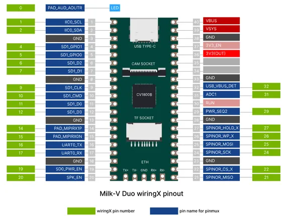
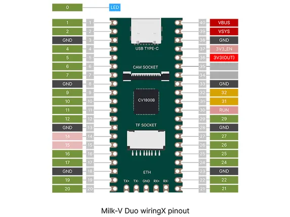
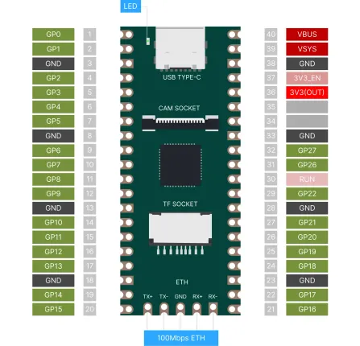
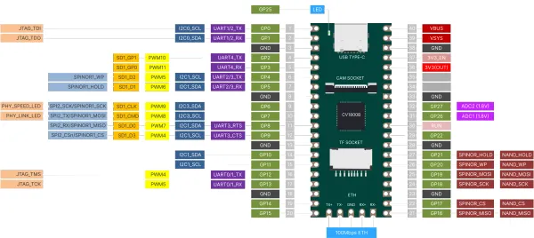
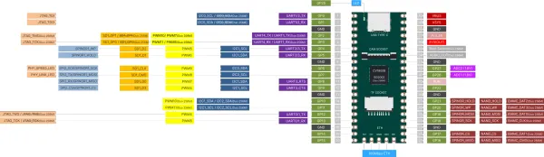

# Duo

**Milk-V** · Other SBC

Revision: Not identified  
Coverage: Pinout image collected

[Browse all manufacturers](../../../../BROWSE.md) · [Desktop app](https://github.com/valleytechsolutions/black-wire-desktop)

## duo-wiringx-pinout-with-pin-name

**pinout image** · Reviewed source · PNG

[Open original reference](../../../../library/media/011b60e280803482debb410f6e1513e2fd8cabaeb31ee0f7bb0012971f34a11a.png)

**Credit and rights:** Not established; source attribution retained. Source/manufacturer: Milk-V.

[Source 1](https://raw.githubusercontent.com/milk-v/milkv.io/01bc64d3d71bce30faec2bc4ba6dd34310e4ac8c/static/docs/duo/duo-wiringx-pinout-with-pin-name.png) · [Source 2](https://github.com/milk-v/milkv.io/blob/01bc64d3d71bce30faec2bc4ba6dd34310e4ac8c/static/docs/duo/duo-wiringx-pinout-with-pin-name.png)

SHA-256: `011b60e280803482debb410f6e1513e2fd8cabaeb31ee0f7bb0012971f34a11a`

## duo-wiringx-pinout

**pinout image** · Reviewed source · PNG

[Open original reference](../../../../library/media/5f7b613f2ee903b166d5068b24da4aa7c28d5c7e0211e02ba8e2eee88d38eca4.png)

**Credit and rights:** Not established; source attribution retained. Source/manufacturer: Milk-V.

[Source 1](https://raw.githubusercontent.com/milk-v/milkv.io/01bc64d3d71bce30faec2bc4ba6dd34310e4ac8c/static/docs/duo/duo-wiringx-pinout.png) · [Source 2](https://github.com/milk-v/milkv.io/blob/01bc64d3d71bce30faec2bc4ba6dd34310e4ac8c/static/docs/duo/duo-wiringx-pinout.png)

SHA-256: `5f7b613f2ee903b166d5068b24da4aa7c28d5c7e0211e02ba8e2eee88d38eca4`

## duo-pinout-01

**pinout image** · Reviewed source · WEBP

[Open original reference](../../../../library/media/5e9ee75cca84b61e89d2154182b7422b6a51970178d0b55b6c24f2cbe3f535a3.webp)

**Credit and rights:** Not established; source attribution retained. Source/manufacturer: Milk-V.

[Source 1](https://raw.githubusercontent.com/milk-v/milkv.io/01bc64d3d71bce30faec2bc4ba6dd34310e4ac8c/static/docs/duo/duo/duo-pinout-01.webp) · [Source 2](https://github.com/milk-v/milkv.io/blob/01bc64d3d71bce30faec2bc4ba6dd34310e4ac8c/static/docs/duo/duo/duo-pinout-01.webp)

SHA-256: `5e9ee75cca84b61e89d2154182b7422b6a51970178d0b55b6c24f2cbe3f535a3`

## pinout

**pinout image** · Reviewed source · WEBP

[Open original reference](../../../../library/media/8ee95aaeaf8cfcc60fd0f5dc905858168904ba0e57d62ed63e8fbc626c0b427b.webp)

**Credit and rights:** Not established; source attribution retained. Source/manufacturer: Milk-V.

[Source 1](https://raw.githubusercontent.com/milk-v/milkv.io/01bc64d3d71bce30faec2bc4ba6dd34310e4ac8c/static/docs/duo/pinout.webp) · [Source 2](https://github.com/milk-v/milkv.io/blob/01bc64d3d71bce30faec2bc4ba6dd34310e4ac8c/static/docs/duo/pinout.webp)

SHA-256: `8ee95aaeaf8cfcc60fd0f5dc905858168904ba0e57d62ed63e8fbc626c0b427b`

## duo-pinout

**pinout image** · Reviewed source · WEBP

[Open original reference](../../../../library/media/dc6224ae4bb201747aa1304d7604163a2be12aea85cb3d4e7d863c1e92b55037.webp)

**Credit and rights:** Not established; source attribution retained. Source/manufacturer: Milk-V.

[Source 1](https://raw.githubusercontent.com/milk-v/milkv.io/01bc64d3d71bce30faec2bc4ba6dd34310e4ac8c/static/duo/duo-pinout.webp) · [Source 2](https://github.com/milk-v/milkv.io/blob/01bc64d3d71bce30faec2bc4ba6dd34310e4ac8c/static/duo/duo-pinout.webp)

SHA-256: `dc6224ae4bb201747aa1304d7604163a2be12aea85cb3d4e7d863c1e92b55037`

Pin assignments have not been independently electrically verified. Check board revision before wiring.
