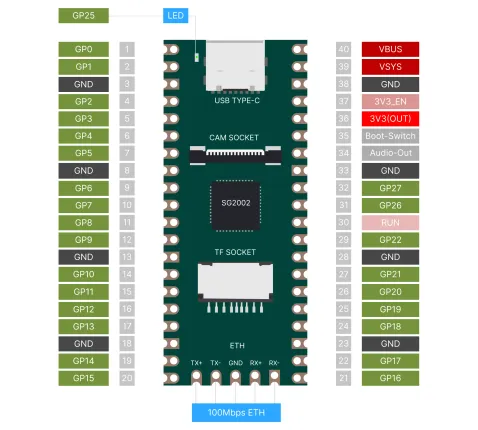

# Duo 256M

**Milk-V** · Other SBC

Revision: Not identified  
Coverage: Pinout image collected

[Browse all manufacturers](../../../../BROWSE.md) · [Desktop app](https://github.com/valleytechsolutions/black-wire-desktop)

## duo256m-pinout-01

**pinout image** · Reviewed source · WEBP

[Open original reference](../../../../library/media/3f22d173811aadfaf536e6e09f1c996a6a25ee0abcbf48c9c9c9232ffc46857e.webp)

**Credit and rights:** Not established; source attribution retained. Source/manufacturer: Milk-V.

[Source 1](https://raw.githubusercontent.com/milk-v/milkv.io/01bc64d3d71bce30faec2bc4ba6dd34310e4ac8c/static/docs/duo/duo256m/duo256m-pinout-01.webp) · [Source 2](https://github.com/milk-v/milkv.io/blob/01bc64d3d71bce30faec2bc4ba6dd34310e4ac8c/static/docs/duo/duo256m/duo256m-pinout-01.webp)

SHA-256: `3f22d173811aadfaf536e6e09f1c996a6a25ee0abcbf48c9c9c9232ffc46857e`

Pin assignments have not been independently electrically verified. Check board revision before wiring.
