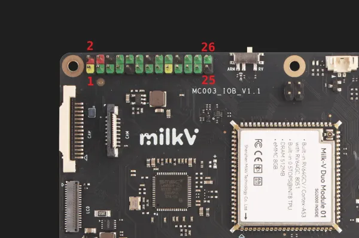

# Duo Module 01 EVB

**Milk-V** · Other SBC

Revision: Not identified  
Coverage: Board labels only; pinout needed

[Browse all manufacturers](../../../../BROWSE.md) · [Desktop app](https://github.com/valleytechsolutions/black-wire-desktop)

## Header orientation and board labels

**board labeling image** · Reviewed source · WEBP

[Open original reference](../../../../library/media/3ad0f7ea4f8bce0979ee15f7492d9e84cf432dddc045f43552c320433224012a.webp)

**Credit and rights:** Not established; source attribution retained. Source/manufacturer: Milk-V.

[Source 1](https://raw.githubusercontent.com/milk-v/milkv.io/01bc64d3d71bce30faec2bc4ba6dd34310e4ac8c/static/docs/duo/dm01/dm01-evb-pinout.webp) · [Source 2](https://github.com/milk-v/milkv.io/blob/01bc64d3d71bce30faec2bc4ba6dd34310e4ac8c/static/docs/duo/dm01/dm01-evb-pinout.webp)

SHA-256: `3ad0f7ea4f8bce0979ee15f7492d9e84cf432dddc045f43552c320433224012a`

Pin assignments have not been independently electrically verified. Check board revision before wiring.
