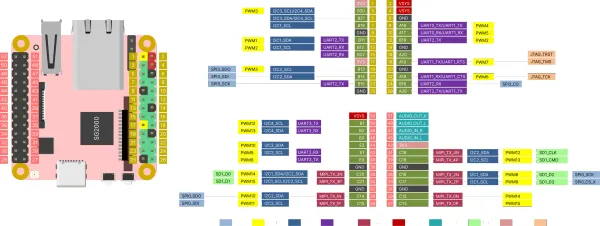
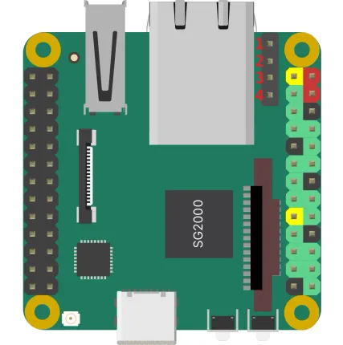

# Duo S

**Milk-V** · Other SBC

Revision: Not identified

Coverage: Pinout image collected

[Browse all manufacturers](../../../../BROWSE.md) · [Devices & IoT](../../../../DEVICES.md) · [Open in the browser guide](https://valleytech-black-wire-guide.pages.dev/?board=milk-v-other-sbc-duo-s)

Architecture: **ARM / RISC-V**

## Specifications and hardware documentation

- [Manufacturer hardware documentation](https://milkv.io/docs/duo/getting-started/download)

## duos-pinout

**pinout image** · Reviewed source · WEBP

[Open original reference](../../../../library/media/8d169269477ccc90ab02a67cc2a083520ebe9999a2ccdfc0a5cccd83ecdb9447.webp)

**Credit and rights:** Not established; source attribution retained. Source/manufacturer: Milk-V.

[Source 1](https://raw.githubusercontent.com/milk-v/milkv.io/01bc64d3d71bce30faec2bc4ba6dd34310e4ac8c/static/duo-s/duos-pinout.webp) · [Source 2](https://github.com/milk-v/milkv.io/blob/01bc64d3d71bce30faec2bc4ba6dd34310e4ac8c/static/duo-s/duos-pinout.webp)

Image revision: Not identified

SHA-256: `8d169269477ccc90ab02a67cc2a083520ebe9999a2ccdfc0a5cccd83ecdb9447`

## Header orientation and board labels

**board labeling image** · Reviewed source · WEBP

[Open original reference](../../../../library/media/187694f8ba72ed672676c1945515b479c1aad0bb5c44e678ae0b979534ba0b87.webp)

**Credit and rights:** Not established; source attribution retained. Source/manufacturer: Milk-V.

[Source 1](https://raw.githubusercontent.com/milk-v/milkv.io/01bc64d3d71bce30faec2bc4ba6dd34310e4ac8c/static/docs/duo/duos/duos-poe-pinout.webp) · [Source 2](https://github.com/milk-v/milkv.io/blob/01bc64d3d71bce30faec2bc4ba6dd34310e4ac8c/static/docs/duo/duos/duos-poe-pinout.webp)

Image revision: Not identified

SHA-256: `187694f8ba72ed672676c1945515b479c1aad0bb5c44e678ae0b979534ba0b87`

Pin assignments have not been independently electrically verified. Check board revision before wiring.
