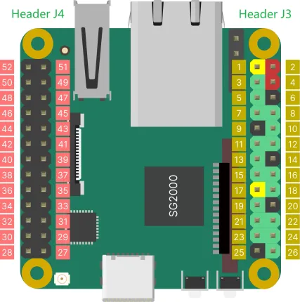

# Duo S v1.1

**Milk-V** · Other SBC

Revision: Not identified

Coverage: Board labels only; pinout needed

[Browse all manufacturers](../../../../BROWSE.md) · [Devices & IoT](../../../../DEVICES.md) · [Open in the browser guide](https://valleytech-black-wire-guide.pages.dev/?board=milk-v-other-sbc-duo-s-v1-1)

Architecture: **ARM / RISC-V**

## Specifications and hardware documentation

- [Manufacturer hardware documentation](https://milkv.io/docs/duo/getting-started/download)

## Header orientation and board labels

**board labeling image** · Reviewed source · WEBP

[Open original reference](../../../../library/media/4d5137c34c7e656453df9ae6aa071729e81b6b81ef454ee79988dd3a4ad49d90.webp)

**Credit and rights:** Not established; source attribution retained. Source/manufacturer: Milk-V.

[Source 1](https://raw.githubusercontent.com/milk-v/milkv.io/01bc64d3d71bce30faec2bc4ba6dd34310e4ac8c/static/docs/duo/duos/duos-pinout-v1.1.webp) · [Source 2](https://github.com/milk-v/milkv.io/blob/01bc64d3d71bce30faec2bc4ba6dd34310e4ac8c/static/docs/duo/duos/duos-pinout-v1.1.webp)

Image revision: Not identified

SHA-256: `4d5137c34c7e656453df9ae6aa071729e81b6b81ef454ee79988dd3a4ad49d90`

Pin assignments have not been independently electrically verified. Check board revision before wiring.
