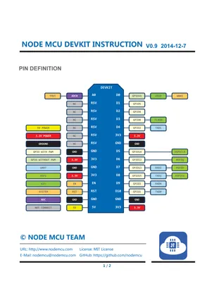

# NodeMCU DevKit 0.9

**NodeMCU** · ESP8266

Revision: Not identified  
Coverage: Pinout image collected

[Browse all manufacturers](../../../../BROWSE.md) · [Desktop app](https://github.com/valleytechsolutions/black-wire-desktop)

## Original board pinout

**pinout image** · Reviewed source · PNG

[Open original reference](../../../../library/media/f728c7e66ab0e445d8accec88f0839cd7834b81874323e86f09552996d1ca248.png)

**Credit and rights:** Not established; source attribution retained. Source/manufacturer: NodeMCU.

[Source 1](https://raw.githubusercontent.com/nodemcu/nodemcu-devkit/b0f19d6d1c49b6db4aef56ddba789a7f92f6ecce/Documents/NODEMCU-DEVKIT-INSTRUCTION-EN_BIG.png) · [Source 2](https://github.com/nodemcu/nodemcu-devkit/blob/b0f19d6d1c49b6db4aef56ddba789a7f92f6ecce/Documents/NODEMCU-DEVKIT-INSTRUCTION-EN_BIG.png)

SHA-256: `f728c7e66ab0e445d8accec88f0839cd7834b81874323e86f09552996d1ca248`

Pin assignments have not been independently electrically verified. Check board revision before wiring.
