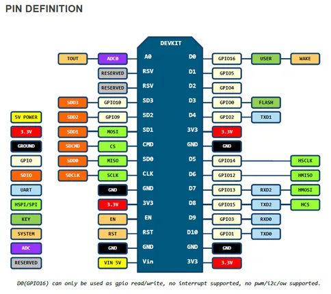

# NodeMCU DevKit 1.0

**NodeMCU** · ESP8266

Revision: Not identified  
Coverage: Pinout image collected

[Browse all manufacturers](../../../../BROWSE.md) · [Desktop app](https://github.com/valleytechsolutions/black-wire-desktop)

## Original board pinout

**pinout image** · Reviewed source · PNG

[Open original reference](../../../../library/media/6109f3520520ffe961bd0e60aa7c1dfba90046151e3da33eea69d17cb34eaefa.png)

**Credit and rights:** Not established; source attribution retained. Source/manufacturer: NodeMCU.

[Source 1](https://raw.githubusercontent.com/nodemcu/nodemcu-devkit-v1.0/7cb0a330a25fad85e701c768ef46064c17d54446/Documents/NODEMCU_DEVKIT_V1.0_PINMAP.png) · [Source 2](https://github.com/nodemcu/nodemcu-devkit-v1.0/blob/7cb0a330a25fad85e701c768ef46064c17d54446/Documents/NODEMCU_DEVKIT_V1.0_PINMAP.png)

SHA-256: `6109f3520520ffe961bd0e60aa7c1dfba90046151e3da33eea69d17cb34eaefa`

Pin assignments have not been independently electrically verified. Check board revision before wiring.
