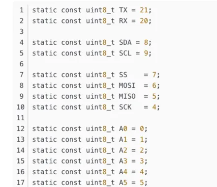

# ESP32-C3 SuperMini

**Nologo** · ESP32-C3

Revision: Not identified  
Coverage: GPIO reference collected; physical pinout needed

[Browse all manufacturers](../../../../BROWSE.md) · [Desktop app](https://github.com/valleytechsolutions/black-wire-desktop)

## GPIO aliases

**GPIO reference image** · Reviewed source · PNG

[Open original reference](../../../../library/media/6345f99163f4a3791ae1399ad1f495257ea5dc75828734290b88b03c28398338.png)

**Credit and rights:** Not established; source attribution retained. Source/manufacturer: Nologo.

[Source 1](https://www.nologo.tech/assets/img/esp32/esp32c3supermini/esp32c3foot2.png) · [Source 2](https://www.nologo.tech/product/esp32/esp32c3/esp32c3supermini/esp32C3SuperMiniFoot.html)

Unchanged image from Nologo catalog documentation. Nologo is the catalog attribution; maker identity is not independently verified for every product it sells. Exact physical PCB must match the source image, not merely the SuperMini name.

SHA-256: `6345f99163f4a3791ae1399ad1f495257ea5dc75828734290b88b03c28398338`

Pin assignments have not been independently electrically verified. Check board revision before wiring.
