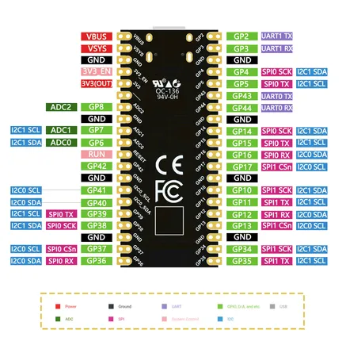

# ESP32-S2 Pico

**Nologo** · ESP32-S2

Revision: Not identified  
Coverage: Pinout image collected

[Browse all manufacturers](../../../../BROWSE.md) · [Desktop app](https://github.com/valleytechsolutions/black-wire-desktop)

## Pinout - Nologo documentation

**pinout image** · Reviewed source · PNG

[Open original reference](../../../../library/media/0e441bcf68d7359747d39e79cc4cb2b4ce611bdd4e2e7d15bd155d1d61b357df.png)

**Credit and rights:** Not established; source attribution retained. Source/manufacturer: Nologo.

[Source 1](https://www.nologo.tech/assets/img/esp32/esp32s2pico/esp32s2picofoot.png) · [Source 2](https://www.nologo.tech/product/esp32/esp32s2/esp32s2pico/esp32S2Pico.html)

Unchanged image from Nologo catalog documentation. Nologo is the catalog attribution; maker identity is not independently verified for every product it sells. Exact physical PCB must match the source image, not merely the SuperMini name.

SHA-256: `0e441bcf68d7359747d39e79cc4cb2b4ce611bdd4e2e7d15bd155d1d61b357df`

Pin assignments have not been independently electrically verified. Check board revision before wiring.
