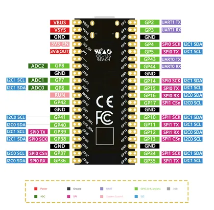

# ESP32-S2 Pico

**Nologo** · ESP32-S2

Revision: Not identified

Coverage: Pinout image collected

[Browse all manufacturers](../../../../BROWSE.md) · [Devices & IoT](../../../../DEVICES.md) · [Open in the browser guide](https://valleytech-black-wire-guide.pages.dev/?board=nologo-esp32-esp32-s2-pico)

## Datasheets and original documentation

Board datasheet: **not yet recorded**. Visual reference: **available**.

Original manufacturer website still needs identification.

A chip datasheet, schematic and board datasheet have different scopes. Match the exact hardware revision.

[Documentation coverage and remaining gaps](../../../../DOCUMENTATION.md)

## Pinout - Nologo documentation

**pinout image** · Reviewed source · PNG

[Open original reference](../../../../library/media/0e441bcf68d7359747d39e79cc4cb2b4ce611bdd4e2e7d15bd155d1d61b357df.png)

**Credit and rights:** Not established; source attribution retained. Source/manufacturer: Nologo.

[Source 1](https://www.nologo.tech/assets/img/esp32/esp32s2pico/esp32s2picofoot.png) · [Source 2](https://www.nologo.tech/product/esp32/esp32s2/esp32s2pico/esp32S2Pico.html)

Unchanged image from Nologo catalog documentation. Nologo is the catalog attribution; maker identity is not independently verified for every product it sells. Exact physical PCB must match the source image, not merely the SuperMini name.

Image revision: Not identified

SHA-256: `0e441bcf68d7359747d39e79cc4cb2b4ce611bdd4e2e7d15bd155d1d61b357df`

Pin assignments have not been independently electrically verified. Check board revision before wiring.
