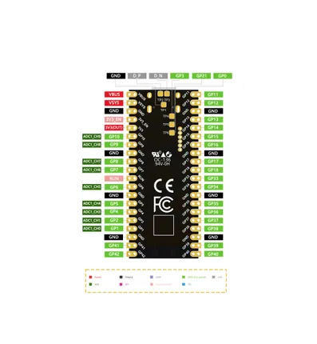
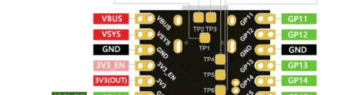

# ESP32-S3 Pico

**Nologo** · ESP32-S3

Revision: Not identified  
Coverage: Pinout image collected

[Browse all manufacturers](../../../../BROWSE.md) · [Desktop app](https://github.com/valleytechsolutions/black-wire-desktop)

## Pinout - Nologo documentation

**pinout image** · Reviewed source · JPG

[Open original reference](../../../../library/media/00232b15f02930ea319d00bc03551115ec9a29125bcddd4cc557b877f7c3d9ed.jpg)

**Credit and rights:** Not established; source attribution retained. Source/manufacturer: Nologo.

[Source 1](https://www.nologo.tech/assets/img/esp32/esp32s3pico/esp32s3picofoot.png) · [Source 2](https://www.nologo.tech/product/esp32/esp32s3/esp32s3Pico/esp32s3pico_arduino/esp32s3pico_arduino_7.html)

Unchanged image from Nologo catalog documentation. Nologo is the catalog attribution; maker identity is not independently verified for every product it sells. Exact physical PCB must match the source image, not merely the SuperMini name.

SHA-256: `00232b15f02930ea319d00bc03551115ec9a29125bcddd4cc557b877f7c3d9ed`

## Power and test-pad excerpt

**pinout image** · Reviewed source · PNG

[Open original reference](../../../../library/media/4159ea2e1efbbb38d2cb3c696d22296196fd21d6f1aeb3f6f7742269b8121396.png)

**Credit and rights:** Not established; source attribution retained. Source/manufacturer: Nologo.

[Source 1](https://www.nologo.tech/assets/img/esp32/esp32s3pico/esp32picofoot1.png) · [Source 2](https://www.nologo.tech/product/esp32/esp32s3/esp32s3Pico/esp32s3pico_arduino/esp32s3pico_arduino_7.html)

Unchanged image from Nologo catalog documentation. Nologo is the catalog attribution; maker identity is not independently verified for every product it sells. Exact physical PCB must match the source image, not merely the SuperMini name.

**Partial diagram. Confirm missing pins against the exact board documentation.**

SHA-256: `4159ea2e1efbbb38d2cb3c696d22296196fd21d6f1aeb3f6f7742269b8121396`

Pin assignments have not been independently electrically verified. Check board revision before wiring.
